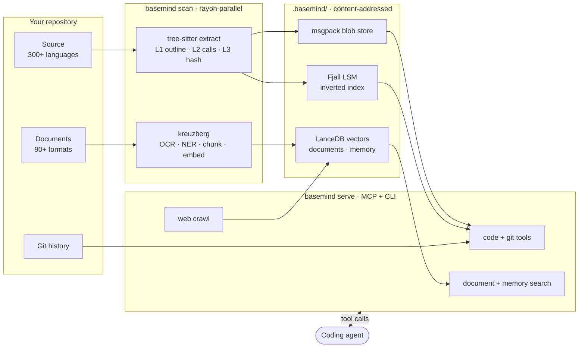
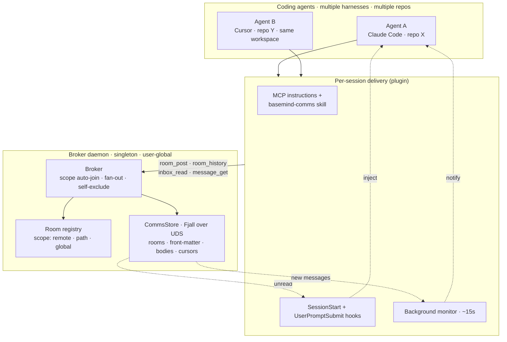
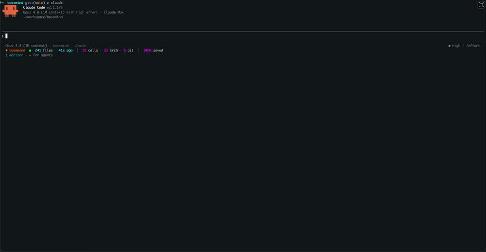

<!-- markdownlint-disable MD033 MD041 -->
<div align="center">

# basemind

**The context and communication layer for coding agents.** basemind is the shared brain a team of
AI coding agents works from. It turns any repository into an always-current understanding of the
code, documents, history, and memory an agent needs — and gives multiple agents a way to **talk to
each other and coordinate** while they work.

The payoff is twofold: each agent reasons from **structure and search** instead of burning its
limited context window on `grep` and file reads, and a team of agents stays **in sync** instead of
stepping on each other's work. One server does both.

Code map & search across **300+ languages** · document processing for **90+ file formats** ·
semantic + full-text search · git history & blame · shared agent memory · on-demand web crawl ·
agent-to-agent comms

[](https://crates.io/crates/basemind)
[](https://www.npmjs.com/package/basemind)
[](https://pypi.org/project/basemind/)
[](https://github.com/Goldziher/basemind/actions/workflows/ci.yaml)
[](LICENSE)

[Quickstart](#quickstart) · [Install](#installation) · [Capabilities](#capabilities) · [Architecture](#architecture) · [Tools](#feature-table) · [Performance](#performance)

</div>

---

## Capabilities

Four pillars give an agent **context**; a fifth lets agents **coordinate**.

**Code** — Tree-sitter outlines, symbol search, reference + caller + implementation graphs,
call chains, git history per symbol, blame at symbol-level resolution.

**Documents** — Ingest + semantic search over PDFs, Office (Word/Excel/iWork), HTML, email,
archives. Built-in OCR, layout detection, keyword + NER extraction, cross-encoder reranking.
All ONNX bundled — no system install needed.

**Memory** — Per-repo scoped key-value + semantic vector storage, split into a shared **group**
tier and a per-agent **individual** tier. Clones of the same git origin automatically share
memory; unrelated repos isolated.

**Web** — On-demand HTTP scrape + follow-link crawl. Pages chunk, embed, and land in the
documents store under scope `web:<host>` for unified search.

**Coordination** — A user-global broker daemon hosts scoped chat rooms and a per-agent inbox, so
multiple agents working the same code (across harnesses and repos) leave each other status, ask
questions, and avoid collisions. See [Agent coordination](#agent-coordination).

---

## Context economy

basemind tools return **paths, line numbers, and signatures — not file bodies** — so a
structural answer costs a fraction of the tokens of reading source. The plugin ships this as
the agent's default operating discipline (carried in the MCP server instructions, the
`basemind` skill, and the SessionStart hook):

- `outline` a file before opening it — then read only the span you need.
- `search_symbols` instead of `grep`/`rg` for a definition.
- `find_references` / `find_callers` instead of grepping call sites.
- `workspace_grep` instead of shelling out to ripgrep for regex over content.
- `rescan` after edits instead of reconnecting the server.
- Don't re-read a file basemind already mapped.

The plugin also ships a PreToolUse **guard hook** that reaches the agent at the moment it reaches
for search: by default (`BASEMIND_GUARD=nudge`) it points `Grep`/`Glob` calls at the matching
basemind tool, once per session. Set `BASEMIND_GUARD=redirect` to enforce it (the call is blocked
with a pointer to the basemind tool) or `BASEMIND_GUARD=off` to disable.

An opt-in PostToolUse **output compressor** (default off) is also shipped: set
`BASEMIND_COMPRESS_OUTPUT=1` to pipe verbose `Bash` output through `basemind compress-output`
before the agent sees it. It is fail-open and credential-preserving — output is left untouched on
any error, on detected credentials, or whenever it would save less than 10%.

An opt-in PostToolUse **read-cache delta** (default off) is shipped alongside it: set
`BASEMIND_DELTA_READS=1` to serve a compact `basemind delta` line-diff when an agent re-reads a file
it already read this session, saving the tokens of a full re-read. It is fail-open — the full read
stands on any error, on a first read, or whenever the diff is not meaningfully smaller.

The live statusline surfaces the payoff: estimated tokens saved vs a grep + read baseline.

---

## Token reduction

basemind reduces tokens via **code-aware structural compression**, not lossy prose-style dropping. The
`compress` tool handles both: for source code it returns signatures + imports (no file bodies) via the L1
outline; for prose text it applies lexical passes (whitespace collapse, conservative filler removal, paragraph dedup).
Both yield honest before/after token counts and byte-for-byte integrity on code.

**Why this matters:** tools that prune tokens via LM-based pruning or aggressive phrase removal sacrifice code
correctness (a function signature is useless without its shape). basemind's approach leverages the tree-sitter
code map to understand structure — what's a symbol vs a comment vs a docstring — so compression never corrupts
working code.

Compare against the current landscape:

<!-- markdownlint-disable MD013 -->

| Tool | Approach | Code-aware? | Interface | Lossless for code |
|---|---|---|---|---|
| **basemind** | Structural elision (L1 outline) + lexical prose pass | Yes (tree-sitter) | MCP + CLI | Yes |
| LLMLingua-2 | LM token-pruning (PyTorch, 124M–7B) | No | Python lib | No |
| token-optimizer | Behavioral + bash-output compression, delta reads | No | CLI / MCP | Partial |
| token-optimizer-mcp | SQLite cache + Brotli + smart tool replacement | No (caching-driven) | MCP | Partial |
| mcp-compressor | MCP tool-schema overhead deferral | No (schema-only) | MCP | Yes |
| CodePromptZip | Research-grade code pruning | Yes (static analysis) | Research / paper | No |

<!-- markdownlint-enable MD013 -->

**Roadmap:** per-call `max_tokens` budgets, semantic prose reduction (via kreuzberg), and MCP tool-schema
compression (struct/field trimming for deeply-nested responses) land in the next release.

---

## Architecture

One `basemind scan` walks the working tree in parallel (rayon), extracts structure with
tree-sitter and documents with the kreuzberg pipeline, and writes everything into a
content-addressed store under `.basemind/`: msgpack blobs (deduped by content hash), a Fjall LSM
inverted index for symbol/reference/caller lookups, and a LanceDB vector store for document +
memory search. `basemind serve` preloads the outlines into RAM and answers MCP/CLI tool calls
straight from the index — no disk scan per query.



### Agent coordination

basemind is also a communication substrate for **multiple agents working the same code at once** —
across harnesses and across repos in a shared workspace. A singleton, user-global **broker daemon**
(its own Fjall store over a Unix socket, independent of any repo's exclusive index lock) hosts
**scoped rooms**: an agent auto-joins every room whose scope covers it — the repo's git remote, a
path prefix, or global. Messages are **two-tier** — a front-matter envelope (subject · from · id)
that `room_history` / `inbox_read` scan cheaply, and a body fetched on demand by `message_get` — so
scanning a busy room costs almost nothing. The broker excludes an agent's **own** posts from its
inbox, so notifications never echo back.

The plugin delivers comms three ways, so an agent notices traffic without being asked: the
**MCP instructions + `basemind-comms` skill** tell it the tools exist and to post status as it
works; **SessionStart / UserPromptSubmit hooks** inject unread front-matter on boot and per turn;
and a **background monitor (~15 s)** surfaces new messages while the agent is working or idle.



---

## Feature table

<!-- markdownlint-disable MD013 -->

| Pillar | What it does | MCP tools | Backend |
|---|---|---|---|
| **Code intelligence** | Outlines, symbol search (substring), call-site lookup (substring), call graphs, impl lookup (substring), dependents, in-tree regex | `outline`, `search_symbols`, `workspace_grep`, `find_references`, `find_callers`, `call_graph`, `find_implementations`, `dependents`, `list_files`, `status`, `repo_info` | tree-sitter × 300+ langs · Fjall LSM index · content-addressed blob store |
| **Git intelligence** | Symbol-level history, blame, churn, recent changes, structural diffs across revs | `symbol_history`, `blame_file`, `blame_symbol`, `hot_files`, `recent_changes`, `commits_touching`, `find_commits_by_path`, `diff_outline`, `diff_file`, `working_tree_status` | gix + sha-keyed disk cache |
| **Document RAG** | Ingest + semantic search over 90+ file formats — PDFs, Office (Excel/Word/HWP/iWork), HTML, XML, email, archives, images. Adds OCR (Tesseract + PaddleOCR), cross-encoder reranker, keyword extraction (YAKE/RAKE), NER (gline-rs ONNX + LLM), extractive + abstractive summarization, layout detection, page auto-rotate, redaction, language detection. All ONNX models bundled — no system install needed. | `search_documents` | kreuzberg + LanceDB |
| **Shared memory** | Per-repo scoped key-value + semantic memory. Clones of the same git origin URL automatically share memory; unrelated repos isolated. | `memory_put`, `memory_get`, `memory_list`, `memory_search`, `memory_delete` | LanceDB + Fjall, scope-keyed |
| **Web crawl** | On-demand HTTP scrape + link-following crawl. Crawled pages route through the documents pipeline (chunk → embed → LanceDB) under scope `web:<host>`. | `web_scrape`, `web_crawl`, `web_map` | kreuzcrawl (native HTTP, no chromium) |
| **Agent comms** | Multi-agent messaging via a user-global broker daemon: scope-auto-joined rooms (git remote / path / global), per-agent inbox, two-tier messages (front-matter scan + lazy body fetch), self-posts excluded from inbox. `room_post` takes an optional `scope` (glob / path patterns) so peers can filter relevance from front-matter; front-matter now also surfaces `seq`. `inbox_ack` advances the per-agent read cursor (by message ids or bulk `to_seq`) without touching the shared log. Delivered across harnesses via MCP instructions + the `basemind-comms` skill, SessionStart / per-turn hooks, and a ~15 s background monitor. | `agent_register`, `agent_list`, `room_create`, `room_list`, `room_join`, `room_leave`, `room_post`, `room_history`, `message_get`, `inbox_read`, `inbox_ack` | Fjall broker over a Unix socket |
| **Admin** | Live rescan, telemetry dashboard, cache introspection + GC + cleanup | `rescan`, `telemetry_summary`, `cache_stats`, `cache_gc`, `cache_clear` | — |
| **Token compression** | Code-aware compression: structural elision (L1 outline, signatures only, no bodies) for indexed source files; lexical pass (whitespace collapse, filler removal, paragraph dedup) for prose. `expand` is the companion: given a path + symbol name it returns the full source body from the L1 byte range — the context-offloading pattern (compress to outline, expand only what you need). | `compress`, `expand` | L1 code map · Rust regex |

<!-- markdownlint-enable MD013 -->

---

## Quickstart

basemind indexes ~81k files in ~22s and answers symbol/reference queries in sub-millisecond time —
see [Performance](#performance) for the full benchmarks.

<!-- markdownlint-disable MD013 -->

<p align="center"></p>

<p align="center"><em>An agent reasoning from structure — <code>outline</code> + <code>find_references</code> in a live Claude Code session, the statusline tracking tokens saved.</em></p>

<p align="center"></p>

<p align="center"><em>The same engine from the CLI — <code>scan</code>, then symbol / reference / call-graph / blame queries and the token-savings dashboard.</em></p>

<p align="center"></p>

<p align="center"><em>Semantic search over the documents store — meaning, not keywords, across 90+ ingested file formats.</em></p>

<!-- markdownlint-enable MD013 -->

**Install in one line** (full reference in the [Installation](#installation) section):

```bash
npm install -g basemind        # or: pip install basemind, cargo install basemind --locked
```

For the Claude Code plugin, paste these into the **Claude Code session** (not your shell):

```text
/plugin marketplace add Goldziher/basemind
/plugin install basemind@basemind
```

Choose the path that fits your workflow. Both paths use the same on-disk index at `.basemind/`.

### Path A: MCP plugin (Claude Code and other harnesses)

MCP (Model Context Protocol) runs the basemind server in-process and exposes all tools as
in-session function calls. Zero config — install and start using tools immediately.

#### Claude Code

In the Claude Code session (not your shell), run these two slash commands in order — the first
registers the marketplace, the second installs the plugin:

```text
/plugin marketplace add Goldziher/basemind
/plugin install basemind@basemind
```

Restart the session after installing. The basemind binary installs automatically on first use
(via npx, uvx, or direct download with verified checksums) — no manual `cargo install` needed.
Prebuilt binaries ship with the full feature set enabled (96 document formats, OCR, embeddings,
reranker, semantic search, web crawl, shared memory), so first use downloads ML models over the
network; binaries are larger as a result.

To enable the optional live statusline (showing context % and per-capability metrics), run `/bm-statusline` once.
This is a one-time opt-in because Claude Code plugins cannot set the main statusline — it is a platform limitation.
See the [Statusline](#statusline) section for details.

#### Any MCP client (Cursor, Codex, Gemini, OpenCode, Continue, Cline, etc.)

```bash
cargo install basemind --features full --locked
```

Add to your MCP config:

```json
{
  "mcpServers": {
    "basemind": {
      "command": "basemind",
      "args": ["serve"]
    }
  }
}
```

Each harness has setup instructions in the [Installation](#installation) section.

### Path B: CLI + skill (scriptable, headless, CI)

Use the standalone `basemind` CLI binary and the `basemind-cli` skill for query-driven exploration.
Same index, same tools, different interface — faster for scripting and batch operations.

```bash
# Install the binary
npm install -g basemind    # or: pip install basemind, cargo install basemind, brew install Goldziher/tap/basemind
basemind scan               # index the working tree once
```

Then use the CLI:

```bash
basemind query outline path/file.rs           # inspect file structure
basemind query symbol "parseQuery"            # find symbol by name
basemind query references "processFile"       # find all call sites
basemind git blame-file src/main.rs           # show per-line blame
basemind cache stats                          # cache stats
basemind cache gc                             # reclaim orphaned blobs
basemind rescan                               # full re-index (rebuild a stale/empty index)
basemind rescan src/main.rs                   # incremental re-index of one path
basemind watch --no-serve                     # live re-index on file change (no MCP server)
```

Add the `basemind-cli` skill to route CLI commands efficiently.
See the [CLI command reference](#cli-command-reference) below for the full command surface.

### MCP vs CLI

Both paths share the same `.basemind/` index and are safe to run alongside each other (the CLI opens
the index read-only; `basemind serve` watches and incrementally updates in the background).

- **MCP**: Wired as in-session tool calls. Zero config. Best for interactive agent workflows.
- **CLI**: Scriptable, headless, CI-friendly. Best for batch queries, integration into non-MCP harnesses,
  and when you want to control the tool routing explicitly.

The choice is not binary — use MCP for interactive sessions and CLI for scripting in the same repo.

#### Statusline

To enable the live statusline in Claude Code (MCP only), run `/bm-statusline` once. This is a one-time
opt-in because Claude Code plugins cannot set the main statusline — it is a platform limitation, not a basemind choice:

- The plugin manifest has no `statusLine` field.
- A plugin-shipped `settings.json` honors only `agent` and `subagentStatusLine`; any `statusLine` key is ignored.
- Hooks communicate via stdout/stderr only — they cannot write to `~/.claude/settings.json`.

`/bm-statusline` works because Claude (the agent) performs the settings edit on your behalf, writing
an **absolute** path into `~/.claude/settings.json`. After that it persists across sessions.

It renders two lines — a context line (model · output-style · dir · branch · context%) and the
basemind line below it:

```text
Opus · basemind · ⎇ main · 12% ctx
◆ basemind  ●  1,247 files · 23m ago  │  312 calls · 180 srch · 44 git · 12 docs  │  1.4M saved  │  ✉ 3 @reviewer
```

The state dot is green (serve active / scan < 1 h), amber (idle or scan 1–24 h), or red (no serve
and stale index). The second segment breaks activity down per capability — searches, git, docs,
memory, web — showing only the buckets with calls today; then estimated tokens saved. When the
agent-comms broker is running, a final `✉` segment shows your unread message count (bright when
non-zero) and, in the full tier, your agent identity. Layout adapts to terminal width (`$COLUMNS`):
the per-capability breakdown drops on narrow terminals. Override with
`BASEMIND_STATUSLINE=full|compact|minimal` (default auto) or hide the context line with
`BASEMIND_STATUSLINE_CONTEXT=0`.

---

## Why basemind, specifically

### vs grep / ripgrep

**What ripgrep does well:** blazing-fast line matching. **What it misses:**

- Grep returns 50+ hits in docs, tests, comments, variable names — agent wastes context filtering noise.
- No scope awareness: `parseQuery()` and `parseQuery` string both match; semantic signals lost.
- Every query re-scans the disk; no pre-computed structures to leverage.

basemind: semantic-quality answers at grep speed via tree-sitter + indexed call sites.

### vs vector-only RAG (LangChain / LlamaIndex DIY stacks)

**What vector RAG does well:** fuzzy document semantic search. **What it misses:**

- Pure embeddings lose exact structure — which function calls which, which class implements which interface.
- No line/column resolution — agent can't map vector hits back to code symbols.
- No git history integration — "what changed recently?" and "who wrote this?" require separate systems.

basemind: code structure + git history + vector memory + document search all in one, unified scope.

### vs context7 / openai-codex / Aider's repo-map

**What these do well:** generate code-map summaries. **What they miss:**

- Static snapshots — stale after the first edit.
- No semantic indexing — every lookup re-parses or re-scans.
- Human-focused output (markdown) instead of agent-facing structure (JSON tools).

basemind: live-updated index with sub-millisecond MCP tools, built for agents not humans.

### vs GitHub native search

**What GitHub does well:** repository-wide fuzzy text search. **What it misses:**

- Cloud-only — your code leaves the machine, latency is network-bound.
- No local-editor integration — agent can't query in-progress edits before commit.
- No cross-language polyglot support — each language's search tuned separately.

basemind: local-only, always-fresh index of your working tree, 300+ languages in one sweep.

---

## Performance

Measured on Apple Silicon, release build, `--features full`, default `eager_l2 = true`. Cold
filesystem cache adds ~50% to first scan; numbers below are warm steady-state.

### Scan throughput

| Repo | Files | Language mix | Time |
|---|---|---|---|
| tokio | 859 | Rust | 0.2 s |
| react | 7 061 | TS / JSX | 2.2 s |
| django | 7 061 | Python | 2.5 s |
| requests | 2 195 | Python | 0.7 s |
| gin | 1 217 | Go | 1.0 s |
| ripgrep | 12 851 | Rust | 4.0 s |
| ripgrep-shallow | 12 851 | Rust | 0.16 s |
| TypeScript compiler | 81 324 | TS / JS / JSON | ~22 s |

The TypeScript compiler is the worst case — 81k files scanned in 22 seconds. Most real repos sit
between tokio and ripgrep. Re-scans skip unchanged content hashes, so warm rescans on edited
working trees are typically dominated by the changed-set size, not repo size.

### Per-tool MCP latency

Against the 81k-file TypeScript index:

<!-- markdownlint-disable MD013 -->

| Latency | Tools |
|---|---|
| < 1 ms | `outline`, `list_files`, `find_references`, `find_callers`, `find_implementations`, `hot_files`, `repo_info` |
| 3–6 ms | `search_symbols`, `call_graph` |
| 4–10 ms | `recent_changes`, `commits_touching`, `find_commits_by_path`, `symbol_history`, `diff_outline`, `diff_file` |
| 20–25 ms | `status` |
| 30–40 ms | `blame_file`, `blame_symbol` |
| 40–200 ms | `workspace_grep` |
| ~200 ms | `search_documents` |
| 350–600 ms | `working_tree_status` |

<!-- markdownlint-enable MD013 -->

basemind preloads L1 outlines into RAM on `serve` start, so code-map queries hit no disk. The Fjall
LSM inverted index handles ref/caller/impl lookups without scanning blobs. Git tools track `gix`
walk cost; Fjall-backed tools dominate only on enormous histories.

---

## Configuration

Full config lives at `schema/basemind-config-v1.schema.json`. Minimal example:

```toml
# .basemind/basemind.toml
file_watch_glob = "**/*.{rs,ts,tsx,py,go}"
eager_l2 = true

[documents]
enabled = true
```

Per-query MCP overrides:

```json
{
  "query": "what does kreuzberg do?",
  "reranker_enabled": true,
  "reranker_preset": "bge-reranker-base"
}
```

Environment variables map mechanically: `--llm-api-key` ↔ `BASEMIND_LLM_API_KEY`. Every MCP tool
accepts per-query overrides that win over file/env/CLI layers.

---

## CLI command reference

CLI commands mirror MCP tools, grouped by capability. Run with `--json` for machine-readable output.

<!-- markdownlint-disable MD013 -->

### Query commands (`basemind query`)

| Command | Purpose |
|---|---|
| `outline <path> [--l2]` | Full per-file structure: symbols + line/col + signatures. `--l2` includes calls + docs. |
| `symbol <needle> [--kind]` | Substring symbol lookup. Optional kind filter (`function`, `class`, etc.). |
| `search <needle>` | Full-text regex search over indexed files. |
| `references <name>` | Substring call-site lookup: all identifiers matching name. Case-sensitive. |
| `callers <path> <name> [--kind]` | Callers of a specific definition (path + name + optional kind). |
| `implementations <trait>` | Substring implementation lookup: types implementing/inheriting from names matching trait. |
| `call-graph <name> [--direction --max-depth]` | BFS call graph (up or down). |
| `grep <pattern> [--language --path-contains]` | Regex search with optional language / path filter. |
| `list-files [--path-contains --language]` | Enumerate indexed paths. Optional filters. |
| `status` | Repository overview: file count, language breakdown, cache directory. |
| `repo-info` | Git info: current branch, HEAD, origin URL. |
| `dependents <module>` | Modules that import a given module. |

### Git commands (`basemind git`)

| Command | Purpose |
|---|---|
| `working-tree-status` | `git status` summary with staged / unstaged classification. |
| `recent-changes [--limit]` | Recent commits with paths + summaries. |
| `commits-touching <path>` | Commits that modified a given path. |
| `find-commits-by-path <pattern>` | Path-filtered commit log. |
| `hot-files [--limit]` | Churn-ranked files (most frequently modified). |
| `diff-file <path> <old> <new>` | File diff across revisions. |
| `diff-outline <path> [--rev]` | Outline diff across revisions. |
| `blame-file <path>` | Per-line blame (author, commit, message). |
| `blame-symbol <path> <name>` | Per-symbol blame (when symbol last changed). |
| `symbol-history <path> <name>` | Cross-commit structural hash of symbol (when body changed). |

### Memory commands (`basemind memory`, requires `--features memory`)

| Command | Purpose |
|---|---|
| `put <key> <value>` | Store a value (scoped to repo origin). |
| `get <key>` | Retrieve exact key. |
| `list [--prefix]` | List all keys or keys matching prefix. |
| `search <query>` | Vector similarity search over stored values. |
| `delete <key>` | Delete a key. |
| `search-documents <query>` | Semantic search over documents + memory (scoped to repo). |

### Cache commands (`basemind cache`)

| Command | Purpose |
|---|---|
| `stats` | On-disk cache size + orphan accounting (blob store + index + git cache). |
| `gc` | Reclaim orphaned blobs (safe to run while serve is running). |
| `clear --component <blobs\|views\|lance\|git-cache\|telemetry\|all>` | Selective or full cache clear. Destructive to `views` and `all` — use CLI, not MCP. |

### Web commands (`basemind web`, requires `--features crawl`)

| Command | Purpose |
|---|---|
| `scrape <url>` | Ingest a single page (chunk → embed → LanceDB). |
| `crawl <seed-url>` | Link-following crawl from a seed URL. |
| `map <url>` | Sitemap + link discovery (no bodies). |

### Comms commands (`basemind comms`)

| Command | Purpose |
|---|---|
| `rooms` | List joined + joinable rooms (MCP `room_list`). |
| `join <room>` / `leave <room>` | Join / leave a room. |
| `room-create <room>` | Create a new room. |
| `post <room> <subject> [--body … --reply-to … --tag …]` | Post a message. |
| `history <room>` | Front-matter of recent messages (subject / from / id). |
| `inbox [--mark-read]` | Front-matter of your inbox (MCP `inbox_read`). |
| `read <id>` | Fetch one message body by id (MCP `message_get`). |
| `register --name <handle>` / `agents` | Record your handle / list active agents. |
| `status` / `start` / `stop` | Broker daemon: report status / ensure running / drain. |

### Other commands

| Command | Purpose |
|---|---|
| `scan` | Full index scan. |
| `watch [--no-serve]` | Live re-index on file change. Run `--no-serve` for continuous background watch without the MCP server. |
| `serve [--no-watch]` | Start the MCP server. By default, watches and incrementally refreshes the index in the background. Run `--no-watch` to disable for very large repos or CI. |
| `init` | Initialize a `.basemind/` directory (optional — `scan` creates it). |
| `telemetry` | Show per-tool telemetry histogram + estimated tokens saved. |

<!-- markdownlint-enable MD013 -->

---

## Installation

<!-- markdownlint-disable MD013 -->

| Channel | Command | Platforms | Features |
|---|---|---|---|
| Homebrew | `brew install Goldziher/tap/basemind` | macOS, Linux | documents + memory + crawl |
| npm | `npm install -g basemind` | any Node 14+ platform | documents + memory + crawl |
| pip | `pip install basemind` | any Python 3.8+ platform | documents + memory + crawl |
| cargo | `cargo install basemind --locked` | any Rust platform | base |
| cargo (full) | `cargo install basemind --features full --locked` | any Rust platform | documents + memory + crawl |
| GH releases | Download binary from [releases](https://github.com/Goldziher/basemind/releases) | macOS · Linux · Windows | documents + memory + crawl |

<!-- markdownlint-enable MD013 -->

<details>
<summary><strong>Harness-specific setup</strong></summary>

| Harness | Install command |
|---|---|
| Claude Code | `/plugin marketplace add Goldziher/basemind` then `/plugin install basemind@basemind` |
| Cursor | See Cursor docs for plugin install flow; `basemind` manifest at `.cursor-plugin/plugin.json` |
| Codex CLI | `codex plugin marketplace add Goldziher/basemind` then install `basemind` via `/plugins` |
| Codex App | Plugins panel → Developer Tools category → basemind → `+` |
| Gemini CLI | `gemini extensions install https://github.com/Goldziher/basemind` |
| OpenCode | Add `{ "plugin": ["basemind-opencode@latest"] }` to `opencode.json` |
| Factory Droid | `droid plugin --help` (manifest at `.claude-plugin/marketplace.json`) |
| GitHub Copilot CLI | `copilot plugin --help` (same manifest) |
| Generic MCP | See "Any MCP client" section above |

</details>
