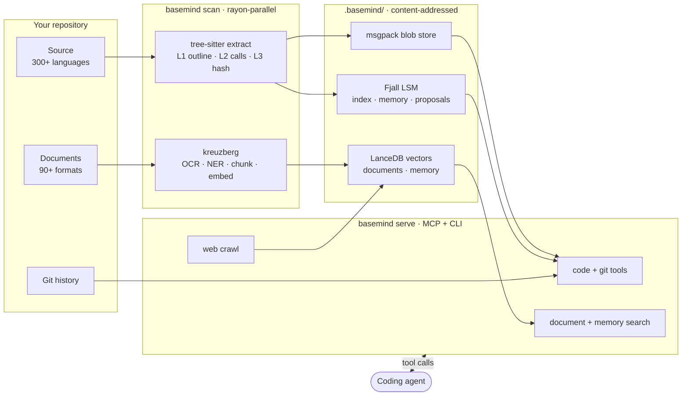
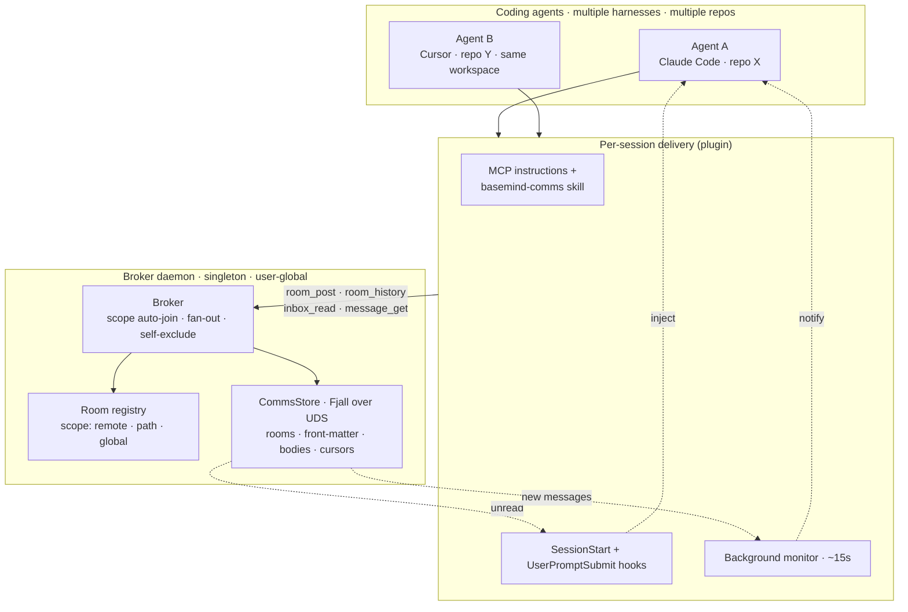

<!-- markdownlint-disable MD033 MD041 -->
<div align="center">

# basemind

**The context and communication layer for coding agents.** basemind is the shared brain a team of
AI coding agents works from. It turns any repository into an always-current understanding of the
code, documents, history, and memory an agent needs — and gives multiple agents a way to **talk to
each other and coordinate** while they work.

The payoff is twofold: each agent reasons from **structure and search** instead of burning its
limited context window on `grep` and file reads, and a team of agents stays **in sync** instead of
stepping on each other's work. One server does both.

Code map & search across **300+ languages** · document processing for **90+ file formats** ·
semantic + full-text search · git history & blame · shared agent memory · on-demand web crawl ·
agent-to-agent comms

[](https://crates.io/crates/basemind)
[](https://www.npmjs.com/package/basemind)
[](https://pypi.org/project/basemind/)
[](https://github.com/Goldziher/basemind/actions/workflows/ci.yaml)
[](LICENSE)

[Install](#installation) · [Capabilities](#capabilities) · [Architecture](#architecture) · [Tools](#feature-table) · [Performance](#performance)

</div>

---

## Capabilities

Five pillars give an agent **context**; a sixth lets agents **coordinate**.

**Code** — Tree-sitter outlines, symbol search, reference + caller + implementation graphs,
call chains, git history per symbol, blame at symbol-level resolution.

**Documents** — Ingest + semantic search over PDFs, Office (Word/Excel/iWork), HTML, email,
archives. Built-in OCR, layout detection, keyword + NER extraction, cross-encoder reranking.
All ONNX bundled — no system install needed.

**Memory** — Per-repo scoped key-value + semantic vector storage, split into a shared **group**
tier and a per-agent **individual** tier. Clones of the same git origin automatically share
memory; unrelated repos isolated.

**Governance** — Mines co-change patterns from git history into propose-don't-commit skill/memory
candidates; an accepted proposal becomes a searchable memory with file provenance, re-audited against
the live index (`proposals_mine` / `proposal_accept`).

**Web** — On-demand HTTP scrape + follow-link crawl. Pages chunk, embed, and land in the
documents store under scope `web:<host>` for unified search.

**Coordination** — A user-global broker daemon hosts scoped chat rooms and a per-agent inbox, so
multiple agents working the same code (across harnesses and repos) leave each other status, ask
questions, and avoid collisions. See [Agent coordination](#agent-coordination).

---

## Demos

<!-- markdownlint-disable MD013 -->

<p align="center"></p>

<p align="center"><em>An agent reasoning from structure — <code>outline</code> + <code>find_references</code> in a live Claude Code session, the statusline tracking tokens saved.</em></p>

<p align="center"></p>

<p align="center"><em>The same engine from the CLI — <code>scan</code>, then symbol / reference / call-graph / blame queries and the token-savings dashboard.</em></p>

<p align="center"></p>

<p align="center"><em>Semantic search over the documents store — meaning, not keywords, across 90+ ingested file formats.</em></p>

<!-- markdownlint-enable MD013 -->

---

## Token economy

basemind tools return **paths, line numbers, and signatures — not file bodies** — so a structural
answer costs a fraction of the tokens of reading source. The live statusline surfaces the payoff:
estimated tokens saved vs a grep + read baseline.

### Operating discipline

The plugin ships token discipline as the agent's default (carried in the MCP server instructions, the
`basemind` skill, and the SessionStart hook):

- `outline` a file before opening it — then read only the span you need.
- `search_symbols` instead of `grep`/`rg` for a definition.
- `find_references` / `find_callers` instead of grepping call sites.
- `workspace_grep` instead of shelling out to ripgrep for regex over content.
- `rescan` after edits instead of reconnecting the server.
- Don't re-read a file basemind already mapped.

Three hooks enforce this at the tool boundary:

- **Guard** (PreToolUse) — `BASEMIND_GUARD=nudge` (default) points `Grep`/`Glob` at the matching
  basemind tool once per session; `redirect` blocks the call with a pointer; `off` disables.
- **Output compressor** (PostToolUse, opt-in) — `BASEMIND_COMPRESS_OUTPUT=1` pipes verbose `Bash`
  output through `basemind compress-output`. Fail-open and credential-preserving (left untouched on
  any error, on detected credentials, or <10% savings).
- **Read-cache delta** (PostToolUse, opt-in) — `BASEMIND_DELTA_READS=1` serves a compact `basemind
  delta` line-diff when an agent re-reads a file it already read this session. Fail-open.

### Compression

basemind compresses via **code-aware structural elision**, not lossy prose dropping — because a
function signature is useless without its shape. The `compress` tool returns signatures + imports (no
bodies) from the L1 outline for source code, and a lexical pass (whitespace collapse, conservative
filler removal, paragraph dedup) for prose, with honest before/after token counts and byte-for-byte
integrity on code. `expand` is the companion: it pulls one symbol's full body back from the L1 byte
range — compress to outline, expand only what you need. A soft per-call `target_tokens` hint is
accepted today. `compress` / `expand` are MCP tools; the CLI-side compression primitives are
`compress-output` and `delta` (the hook backends above).

Compare against the current landscape:

<!-- markdownlint-disable MD013 -->

| Tool | Approach | Code-aware? | Interface | Lossless for code |
|---|---|---|---|---|
| **basemind** | Structural elision (L1 outline) + lexical prose pass | Yes (tree-sitter) | MCP + CLI | Yes |
| LLMLingua-2 | LM token-pruning (PyTorch, 124M–7B) | No | Python lib | No |
| token-optimizer | Behavioral + bash-output compression, delta reads | No | CLI / MCP | Partial |
| token-optimizer-mcp | SQLite cache + Brotli + smart tool replacement | No (caching-driven) | MCP | Partial |
| mcp-compressor | MCP tool-schema overhead deferral | No (schema-only) | MCP | Yes |
| CodePromptZip | Research-grade code pruning | Yes (static analysis) | Research / paper | No |

<!-- markdownlint-enable MD013 -->

**Roadmap:** hard `max_tokens` caps (beyond today's soft `target_tokens` hint), semantic prose
reduction (via kreuzberg), and MCP tool-schema compression (struct/field trimming for deeply-nested
responses).

---

## Architecture

One `basemind scan` walks the working tree in parallel (rayon), extracts structure with
tree-sitter and documents with the kreuzberg pipeline, and writes everything into a
content-addressed store under `.basemind/`: msgpack blobs (deduped by content hash), a Fjall LSM
inverted index for symbol/reference/caller lookups, and a LanceDB vector store for document +
memory search. `basemind serve` preloads the outlines into RAM and answers MCP/CLI tool calls
straight from the index — no disk scan per query.



### Agent coordination

basemind is also a communication substrate for **multiple agents working the same code at once** —
across harnesses and across repos in a shared workspace. A singleton, user-global **broker daemon**
(its own Fjall store over a Unix socket, independent of any repo's exclusive index lock) hosts
**scoped rooms**: an agent auto-joins every room whose scope covers it — the repo's git remote, a
path prefix, or global. Messages are **two-tier** — a front-matter envelope (subject · from · id)
that `room_history` / `inbox_read` scan cheaply, and a body fetched on demand by `message_get` — so
scanning a busy room costs almost nothing. The broker excludes an agent's **own** posts from its
inbox, so notifications never echo back.

The plugin delivers comms three ways, so an agent notices traffic without being asked: the
**MCP instructions + `basemind-comms` skill** tell it the tools exist and to post status as it
works; **SessionStart / UserPromptSubmit hooks** inject unread front-matter on boot and per turn;
and a **background monitor (~15 s)** surfaces new messages while the agent is working or idle.



---

## Feature table

<!-- markdownlint-disable MD013 -->

| Pillar | What it does | MCP tools | Backend |
|---|---|---|---|
| **Code intelligence** | Outlines, symbol search (substring), call-site lookup (substring), call graphs, impl lookup (substring), dependents, in-tree regex | `outline`, `search_symbols`, `workspace_grep`, `find_references`, `find_callers`, `call_graph`, `find_implementations`, `dependents`, `list_files`, `status`, `repo_info` | tree-sitter × 300+ langs · Fjall LSM index · content-addressed blob store |
| **Git intelligence** | Symbol-level history, blame, churn, recent changes, structural diffs across revs | `symbol_history`, `blame_file`, `blame_symbol`, `hot_files`, `recent_changes`, `commits_touching`, `find_commits_by_path`, `diff_outline`, `diff_file`, `working_tree_status` | gix + sha-keyed disk cache |
| **Document RAG** | Ingest + semantic search over 90+ file formats — PDFs, Office (Excel/Word/HWP/iWork), HTML, XML, email, archives, images. Adds OCR (Tesseract + PaddleOCR), cross-encoder reranker, keyword extraction (YAKE/RAKE), NER (gline-rs ONNX + LLM), extractive + abstractive summarization, layout detection, page auto-rotate, redaction, language detection. All ONNX models bundled — no system install needed. | `search_documents` | kreuzberg + LanceDB |
| **Shared memory** | Per-repo scoped key-value + semantic memory. Clones of the same git origin URL automatically share memory; unrelated repos isolated. `memory_audit` verifies stored memories' code references against the live index (file/symbol/structural-hash checks), decays importance on stale records, and auto-archives records stale for > 90 days. | `memory_put`, `memory_get`, `memory_list`, `memory_search`, `memory_delete`, `memory_audit` | LanceDB + Fjall, scope-keyed |
| **Governance** | Co-change association-rule mining from git history: propose-don't-commit skill candidates. `proposals_mine` walks recent commits, counts file co-change pairs, and writes content-addressed proposals (blake3 of sorted file-set) to Fjall. `proposal_accept` promotes a proposal to a searchable, LanceDB-embedded memory with file provenance (W10 audit engine stamps `verified`; a later `memory_audit` turns it Stale if any file disappears). `proposal_reject` writes a tombstone so re-mining does not resurface the candidate. | `proposals_mine`, `proposals_list`, `proposal_accept`, `proposal_reject` | Fjall proposals keyspace + LanceDB |
| **Web crawl** | On-demand HTTP scrape + link-following crawl. Crawled pages route through the documents pipeline (chunk → embed → LanceDB) under scope `web:<host>`. | `web_scrape`, `web_crawl`, `web_map` | kreuzcrawl (native HTTP, no chromium) |
| **Agent comms** | Multi-agent messaging via a user-global broker daemon: scope-auto-joined rooms (git remote / path / global), per-agent inbox, two-tier messages (front-matter scan + lazy body fetch), self-posts excluded from inbox. `room_post` takes an optional `scope` (glob / path patterns) so peers can filter relevance from front-matter; front-matter now also surfaces `seq`. `inbox_ack` advances the per-agent read cursor (by message ids or bulk `to_seq`) without touching the shared log. Delivered across harnesses via MCP instructions + the `basemind-comms` skill, SessionStart / per-turn hooks, and a ~15 s background monitor. | `agent_register`, `agent_list`, `room_create`, `room_list`, `room_join`, `room_leave`, `room_post`, `room_history`, `message_get`, `inbox_read`, `inbox_ack` | Fjall broker over a Unix socket |
| **Admin** | Live rescan, telemetry dashboard, cache introspection + GC + cleanup | `rescan`, `telemetry_summary`, `cache_stats`, `cache_gc`, `cache_clear` | — |
| **Token compression** | Code-aware compression: structural elision (L1 outline, signatures only, no bodies) for indexed source files; lexical pass (whitespace collapse, filler removal, paragraph dedup) for prose. `expand` is the companion: given a path + symbol name it returns the full source body from the L1 byte range — the context-offloading pattern (compress to outline, expand only what you need). | `compress`, `expand` | L1 code map · Rust regex |

<!-- markdownlint-enable MD013 -->

---

## Installation

basemind indexes ~81k files in ~22s and answers symbol/reference queries in sub-millisecond time —
see [Performance](#performance) for the full benchmarks.

There are three ways to run basemind, in order of how much they wire up for you — **as a plugin**,
**as an MCP server**, or **as a CLI**. All three share the same on-disk `.basemind/` index and are
safe to run side by side (the plugin/server watch and incrementally update the index; the CLI opens
it read-only).

### Install the binary

The MCP-server and CLI paths need the `basemind` binary on your `PATH`. **The plugin path downloads
it automatically on first use** (verified checksums) — skip this step if you install via a plugin.

<!-- markdownlint-disable MD013 -->

| Channel | Command | Platforms | Features |
|---|---|---|---|
| Homebrew | `brew install Goldziher/tap/basemind` | macOS, Linux | documents + memory + crawl |
| npm | `npm install -g basemind` | any Node 14+ platform | documents + memory + crawl |
| pip | `pip install basemind` | any Python 3.8+ platform | documents + memory + crawl |
| cargo | `cargo install basemind --locked` | any Rust platform | base |
| cargo (full) | `cargo install basemind --features full --locked` | any Rust platform | documents + memory + crawl |
| GH releases | Download binary from [releases](https://github.com/Goldziher/basemind/releases) | macOS · Linux · Windows | documents + memory + crawl |

<!-- markdownlint-enable MD013 -->

Prebuilt binaries (npm / pip / brew / GH releases) ship the full feature set — 90+ document formats,
OCR, embeddings, reranker, semantic search, web crawl, shared memory — so first run downloads the ML
models over the network. `cargo install` without `--features full` builds the base code-map + git
tier only.

#### Troubleshooting the document tier

These two known issues live in the upstream `kreuzberg` dependency; fixes are in progress and basemind
will pick them up on the next dependency bump. Workarounds in the meantime:

- **Model download fails behind a corporate proxy (TLS interception).** First run fetches ML models
  from Hugging Face; on a network with a TLS-MITM proxy the download can fail with a certificate
  error because the HTTP client does not yet accept a custom CA. Install your corporate root CA into
  the OS trust store, try `SSL_CERT_FILE` / `SSL_CERT_DIR` (effective only on some TLS backends), or
  download the models once on an unproxied network and reuse the Hugging Face cache. Tracked upstream:
  [kreuzberg-dev/kreuzberg#1146](https://github.com/kreuzberg-dev/kreuzberg/issues/1146).
- **OCR fails with a missing `tessdata` path.** A released binary can reference a Tesseract `tessdata`
  path from the build machine rather than yours. If OCR errors about missing trained data, set
  `TESSDATA_PREFIX` to your local tessdata directory (e.g. `/opt/homebrew/share/tessdata` after
  `brew install tesseract`). Tracked upstream:
  [kreuzberg-dev/kreuzberg#1145](https://github.com/kreuzberg-dev/kreuzberg/issues/1145).

### As a plugin (recommended)

The plugin is the richest install: it bundles the MCP server (auto-downloading the binary above on
first use), the `basemind` / `basemind-cli` / `basemind-comms` skills, the agent-comms hooks, and
the slash commands. Pick your harness.

<details>
<summary><strong>Claude Code</strong></summary>

In the Claude Code session (not your shell), run these two slash commands in order — the first
registers the marketplace, the second installs the plugin:

```text
/plugin marketplace add Goldziher/basemind
/plugin install basemind@basemind
```

Restart the session afterwards. Run `/bm-statusline` once to enable the live statusline (a one-time
opt-in — Claude Code plugins cannot set the main statusline themselves; see [Statusline](#statusline)).

</details>

<details>
<summary><strong>Codex (CLI &amp; app)</strong></summary>

basemind ships a Codex plugin — `.codex-plugin/plugin.json` plus a Codex-native
`.agents/plugins/marketplace.json` (skills, MCP server, hooks). In the CLI, register the marketplace
and install:

```bash
codex plugin marketplace add Goldziher/basemind
codex plugin add basemind@basemind
```

In the Codex app, open **Plugins** in the sidebar and add basemind. The CLI and IDE extension share
`~/.codex/config.toml`, so the raw [MCP server](#as-an-mcp-server) path works too.

</details>

<details>
<summary><strong>Cursor</strong></summary>

basemind ships a Cursor plugin (`.cursor-plugin/plugin.json` — skills + MCP server). In Cursor Agent
chat, install it from the marketplace (once listed):

```text
/add-plugin basemind
```

Or add it as a team marketplace — **Dashboard → Settings → Plugins → Team Marketplaces → Add
Marketplace → Import from Repo**, pointed at `https://github.com/Goldziher/basemind`. Prefer no
marketplace step? Use the [MCP server](#as-an-mcp-server) path below.

</details>

<details>
<summary><strong>Factory Droid</strong></summary>

```bash
droid plugin marketplace add https://github.com/Goldziher/basemind
droid plugin install basemind@basemind
```

Or use the `/mcp` manager / raw config — see [Factory Droid under MCP server](#as-an-mcp-server).

</details>

<details>
<summary><strong>Gemini CLI</strong></summary>

```bash
gemini extensions install https://github.com/Goldziher/basemind
```

Installs the basemind extension (`gemini-extension.json`) — the MCP server, the `GEMINI.md` context
file, and the SessionStart / per-turn comms hooks. Update later with `gemini extensions update basemind`.

</details>

<details>
<summary><strong>GitHub Copilot CLI</strong></summary>

```bash
copilot plugin marketplace add Goldziher/basemind
copilot plugin install basemind@basemind
```

Or register the raw server with `/mcp add` — see [GitHub Copilot CLI under MCP server](#as-an-mcp-server).

</details>

<details>
<summary><strong>OpenCode</strong></summary>

Add the npm plugin to `opencode.json` (project root) or `~/.config/opencode/opencode.json` (global):

```json
{
  "plugin": ["basemind-opencode@latest"]
}
```

The `basemind-opencode` package ships the skills + slash commands and registers the MCP server.

</details>

<details>
<summary><strong>Kimi Code</strong></summary>

```text
/plugins install https://github.com/Goldziher/basemind
```

Installs the plugin from `kimi.plugin.json` — the MCP server (auto-downloading the binary on first
use) plus the basemind skills, loaded at session start. Or run `/plugins`, open **Marketplace**, and
install basemind. Kimi plugin manifests don't carry hooks, so the agent-comms auto-injection isn't
wired here (the MCP `room_*` tools still work).

</details>

<details>
<summary><strong>Antigravity</strong></summary>

Antigravity (CLI &amp; IDE) shares one MCP config at `~/.gemini/config/mcp_config.json` (or **Settings
→ Customizations → Add MCP+**). [Install the binary](#install-the-binary) first, then:

```json
{
  "mcpServers": {
    "basemind": { "command": "basemind", "args": ["serve"] }
  }
}
```

If you already use the Gemini extension, `agy plugin import gemini` pulls its MCP registrations across.

</details>

<details>
<summary><strong>pi</strong></summary>

```bash
pi install git:github.com/Goldziher/basemind
```

Loads the basemind skills + a session-start bootstrap (the repo-root `package.json` `pi` manifest and
`.pi/extensions/basemind.ts`). pi has no native MCP, so basemind runs through its **CLI** here
(`basemind query …` via pi's `bash` tool — see [As a CLI](#as-a-cli)); to expose the MCP tools,
register `basemind serve` in `<cwd>/.pi/mcp.json` with a pi MCP extension.

</details>

### As an MCP server

If your client speaks MCP but you are not using the basemind plugin, register the stdio server
yourself. [Install the binary](#install-the-binary) first, then add this — the command is `basemind`
and the only argument is `serve`:

```json
{
  "mcpServers": {
    "basemind": { "command": "basemind", "args": ["serve"] }
  }
}
```

Every MCP tool advertises rmcp `ToolAnnotations` — `read_only_hint`, `destructive_hint`,
`idempotent_hint`, `open_world_hint` — so MCP clients can auto-approve read-only tools and prompt
for mutating ones, reducing permission friction. A client-side denial still never reaches the
server.

If `basemind` is not on your `PATH`, use the absolute path from `which basemind`. Per-client
specifics:

<details>
<summary><strong>Claude Code</strong></summary>

```bash
claude mcp add basemind -- basemind serve                # this project (local scope)
claude mcp add --scope user basemind -- basemind serve   # all your projects
```

The `--` separator is required — everything after it is the command and its args. Or commit a
project-shared `.mcp.json` at the repo root:

```json
{
  "mcpServers": {
    "basemind": { "type": "stdio", "command": "basemind", "args": ["serve"] }
  }
}
```

</details>

<details>
<summary><strong>Cursor</strong></summary>

`.cursor/mcp.json` (this project) or `~/.cursor/mcp.json` (all projects):

```json
{
  "mcpServers": {
    "basemind": { "command": "basemind", "args": ["serve"] }
  }
}
```

The command must be on `PATH` or an absolute path. Cursor asks to approve MCP tools on first use.

</details>

<details>
<summary><strong>Windsurf</strong></summary>

Edit `~/.codeium/windsurf/mcp_config.json` (or **Cascade panel → MCP servers → manage**):

```json
{
  "mcpServers": {
    "basemind": { "command": "basemind", "args": ["serve"] }
  }
}
```

Click **Refresh** in the Cascade MCP panel after saving.

</details>

<details>
<summary><strong>Codex (CLI &amp; IDE)</strong></summary>

```bash
codex mcp add basemind -- basemind serve
```

The `--` separator is required. This writes to `~/.codex/config.toml`, which the CLI and the IDE
extension share:

```toml
[mcp_servers.basemind]
command = "basemind"
args = ["serve"]
```

</details>

<details>
<summary><strong>Gemini CLI</strong></summary>

```bash
gemini mcp add basemind basemind serve
```

Or edit `~/.gemini/settings.json` (or project `.gemini/settings.json`):

```json
{
  "mcpServers": {
    "basemind": { "command": "basemind", "args": ["serve"] }
  }
}
```

</details>

<details>
<summary><strong>GitHub Copilot CLI</strong></summary>

Run `/mcp add` inside a Copilot CLI session (Tab between fields, **Ctrl+S** to save), or edit
`~/.copilot/mcp-config.json`:

```json
{
  "mcpServers": {
    "basemind": {
      "type": "local",
      "command": "basemind",
      "args": ["serve"],
      "tools": ["*"]
    }
  }
}
```

The `tools` key is required; `["*"]` exposes all basemind tools.

</details>

<details>
<summary><strong>Factory Droid</strong></summary>

```bash
droid mcp add basemind "basemind serve"
```

Or use the `/mcp` manager inside droid, or edit `~/.factory/mcp.json` (user) or `.factory/mcp.json`
(project):

```json
{
  "mcpServers": {
    "basemind": { "type": "stdio", "command": "basemind", "args": ["serve"] }
  }
}
```

</details>

<details>
<summary><strong>Cline</strong></summary>

Click the **MCP Servers** icon → **Configure** → **Configure MCP Servers**, then add to
`cline_mcp_settings.json`:

```json
{
  "mcpServers": {
    "basemind": { "command": "basemind", "args": ["serve"] }
  }
}
```

</details>

<details>
<summary><strong>Continue</strong></summary>

Create `.continue/mcpServers/basemind.yaml` (MCP works in **agent** mode):

```yaml
name: basemind
version: 0.0.1
schema: v1
mcpServers:
  - name: basemind
    type: stdio
    command: basemind
    args:
      - serve
```

</details>

<details>
<summary><strong>OpenCode (raw MCP, without the plugin)</strong></summary>

Add to `opencode.json` — note the key is `mcp` and `command` is an array:

```json
{
  "mcp": {
    "basemind": {
      "type": "local",
      "command": ["basemind", "serve"],
      "enabled": true
    }
  }
}
```

</details>

<details>
<summary><strong>Any other MCP client</strong></summary>

basemind speaks MCP over stdio. Point your client's server config at the command `basemind` with
args `["serve"]` (the generic block above). Anything that can launch a stdio MCP subprocess works.

</details>

### As a CLI

The standalone binary plus the `basemind-cli` skill — for scripting, headless runs, and CI. Same
`.basemind/` index and the same tools as MCP, driven from the shell. [Install the
binary](#install-the-binary), then:

```bash
basemind scan                                 # index the working tree once
basemind query outline path/file.rs           # inspect file structure
basemind query symbol "parseQuery"            # find a symbol by name
basemind query references "processFile"       # find all call sites
basemind git blame-file src/main.rs           # per-line blame
basemind cache gc                             # reclaim orphaned blobs
basemind rescan src/main.rs                   # incremental re-index of one path
basemind watch                                # live re-index on change (no MCP server)
```

See the [CLI command reference](#cli-command-reference) below for the full command surface.

### MCP vs CLI

- **MCP**: wired as in-session tool calls. Zero config beyond registration. Best for interactive
  agent workflows.
- **CLI**: scriptable, headless, CI-friendly. Best for batch queries, integration into non-MCP
  harnesses, and when you want to control tool routing explicitly.

The choice is not exclusive — the CLI opens the index read-only while `basemind serve` watches and
incrementally updates it, so use MCP for interactive sessions and the CLI for scripting in the same
repo at the same time.

### Statusline

To enable the live statusline in Claude Code (MCP only), run `/bm-statusline` once. This is a one-time
opt-in because Claude Code plugins cannot set the main statusline — it is a platform limitation, not a basemind choice:

- The plugin manifest has no `statusLine` field.
- A plugin-shipped `settings.json` honors only `agent` and `subagentStatusLine`; any `statusLine` key is ignored.
- Hooks communicate via stdout/stderr only — they cannot write to `~/.claude/settings.json`.

`/bm-statusline` works because Claude (the agent) performs the settings edit on your behalf, writing
an **absolute** path into `~/.claude/settings.json`. After that it persists across sessions.

It renders two lines — a context line (model · output-style · dir · branch · context%) and the
basemind line below it:

```text
Opus · basemind · ⎇ main · 12% ctx
◆ basemind  ●  1,247 files · 23m ago  │  312 calls · 180 srch · 44 git · 12 docs  │  1.4M saved  │  ✉ 3 @reviewer
```

The state dot is green (serve active / scan < 1 h), amber (idle or scan 1–24 h), or red (no serve
and stale index). The second segment breaks activity down per capability — searches, git, docs,
memory, web — showing only the buckets with calls today; then estimated tokens saved. When the
agent-comms broker is running, a final `✉` segment shows your unread message count (bright when
non-zero) and, in the full tier, your agent identity. Layout adapts to terminal width (`$COLUMNS`):
the per-capability breakdown drops on narrow terminals. Override with
`BASEMIND_STATUSLINE=full|compact|minimal` (default auto) or hide the context line with
`BASEMIND_STATUSLINE_CONTEXT=0`.

---

## Why basemind, specifically

### vs grep / ripgrep

**What ripgrep does well:** blazing-fast line matching. **What it misses:**

- Grep returns 50+ hits in docs, tests, comments, variable names — agent wastes context filtering noise.
- No scope awareness: `parseQuery()` and `parseQuery` string both match; semantic signals lost.
- Every query re-scans the disk; no pre-computed structures to leverage.

basemind: semantic-quality answers at grep speed via tree-sitter + indexed call sites.

### vs vector-only RAG (LangChain / LlamaIndex DIY stacks)

**What vector RAG does well:** fuzzy document semantic search. **What it misses:**

- Pure embeddings lose exact structure — which function calls which, which class implements which interface.
- No line/column resolution — agent can't map vector hits back to code symbols.
- No git history integration — "what changed recently?" and "who wrote this?" require separate systems.

basemind: code structure + git history + vector memory + document search all in one, unified scope.

### vs context7 / openai-codex / Aider's repo-map

**What these do well:** generate code-map summaries. **What they miss:**

- Static snapshots — stale after the first edit.
- No semantic indexing — every lookup re-parses or re-scans.
- Human-focused output (markdown) instead of agent-facing structure (JSON tools).

basemind: live-updated index with sub-millisecond MCP tools, built for agents not humans.

### vs GitHub native search

**What GitHub does well:** repository-wide fuzzy text search. **What it misses:**

- Cloud-only — your code leaves the machine, latency is network-bound.
- No local-editor integration — agent can't query in-progress edits before commit.
- No cross-language polyglot support — each language's search tuned separately.

basemind: local-only, always-fresh index of your working tree, 300+ languages in one sweep.

---

## Performance

Measured on Apple Silicon, release build, `--features full`, default `eager_l2 = true`. Cold
filesystem cache adds ~50% to first scan; numbers below are warm steady-state.

### Scan throughput

| Repo | Files | Language mix | Time |
|---|---|---|---|
| tokio | 859 | Rust | 0.2 s |
| react | 7 061 | TS / JSX | 2.2 s |
| django | 7 061 | Python | 2.5 s |
| requests | 2 195 | Python | 0.7 s |
| gin | 1 217 | Go | 1.0 s |
| ripgrep | 12 851 | Rust | 4.0 s |
| ripgrep-shallow | 12 851 | Rust | 0.16 s |
| TypeScript compiler | 81 324 | TS / JS / JSON | ~22 s |

The TypeScript compiler is the worst case — 81k files scanned in 22 seconds. Most real repos sit
between tokio and ripgrep. Re-scans skip unchanged content hashes, so warm rescans on edited
working trees are typically dominated by the changed-set size, not repo size.

### Per-tool MCP latency

Against the 81k-file TypeScript index:

<!-- markdownlint-disable MD013 -->

| Latency | Tools |
|---|---|
| < 1 ms | `outline`, `list_files`, `find_references`, `find_callers`, `find_implementations`, `hot_files`, `repo_info` |
| 3–6 ms | `search_symbols`, `call_graph` |
| 4–10 ms | `recent_changes`, `commits_touching`, `find_commits_by_path`, `symbol_history`, `diff_outline`, `diff_file` |
| 20–25 ms | `status` |
| 30–40 ms | `blame_file`, `blame_symbol` |
| 40–200 ms | `workspace_grep` |
| ~200 ms | `search_documents` |
| 350–600 ms | `working_tree_status` |

<!-- markdownlint-enable MD013 -->

basemind preloads L1 outlines into RAM on `serve` start, so code-map queries hit no disk. The Fjall
LSM inverted index handles ref/caller/impl lookups without scanning blobs. Git tools track `gix`
walk cost; Fjall-backed tools dominate only on enormous histories.

---

## Configuration

Full config lives at `schema/basemind-config-v1.schema.json`. Minimal example:

```toml
# .basemind/basemind.toml
file_watch_glob = "**/*.{rs,ts,tsx,py,go}"
eager_l2 = true

[documents]
enabled = true
```

Per-query MCP overrides:

```json
{
  "query": "what does kreuzberg do?",
  "reranker_enabled": true,
  "reranker_preset": "bge-reranker-base"
}
```

Environment variables map mechanically: `--llm-api-key` ↔ `BASEMIND_LLM_API_KEY`. Every MCP tool
accepts per-query overrides that win over file/env/CLI layers.

---

## CLI command reference

CLI commands mirror MCP tools, grouped by capability. Run with `--json` for machine-readable output.

<!-- markdownlint-disable MD013 -->

### Query commands (`basemind query`)

| Command | Purpose |
|---|---|
| `outline <path> [--l2]` | Full per-file structure: symbols + line/col + signatures. `--l2` includes calls + docs. |
| `symbol <needle> [--kind]` | Substring symbol lookup. Optional kind filter (`function`, `class`, etc.). |
| `search <needle>` | Full-text regex search over indexed files. |
| `references <name>` | Substring call-site lookup: all identifiers matching name. Case-sensitive. |
| `callers <path> <name> [--kind]` | Callers of a specific definition (path + name + optional kind). |
| `implementations <trait>` | Substring implementation lookup: types implementing/inheriting from names matching trait. |
| `call-graph <name> [--direction --max-depth]` | BFS call graph (up or down). |
| `grep <pattern> [--language --path-contains]` | Regex search with optional language / path filter. |
| `list-files [--path-contains --language]` | Enumerate indexed paths. Optional filters. |
| `status` | Repository overview: file count, language breakdown, cache directory. |
| `repo-info` | Git info: current branch, HEAD, origin URL. |
| `dependents <module>` | Modules that import a given module. |

### Git commands (`basemind git`)

| Command | Purpose |
|---|---|
| `working-tree-status` | `git status` summary with staged / unstaged classification. |
| `recent-changes [--limit]` | Recent commits with paths + summaries. |
| `commits-touching <path>` | Commits that modified a given path. |
| `find-commits-by-path <pattern>` | Path-filtered commit log. |
| `hot-files [--limit]` | Churn-ranked files (most frequently modified). |
| `diff-file <path> <old> <new>` | File diff across revisions. |
| `diff-outline <path> [--rev]` | Outline diff across revisions. |
| `blame-file <path>` | Per-line blame (author, commit, message). |
| `blame-symbol <path> <name>` | Per-symbol blame (when symbol last changed). |
| `symbol-history <path> <name>` | Cross-commit structural hash of symbol (when body changed). |

### Memory commands (`basemind memory`, requires `--features memory`)

| Command | Purpose |
|---|---|
| `put <key> <value>` | Store a value (scoped to repo origin). |
| `get <key>` | Retrieve exact key. |
| `list [--prefix]` | List all keys or keys matching prefix. |
| `search <query>` | Vector similarity search over stored values. |
| `delete <key>` | Delete a key. |
| `search-documents <query>` | Semantic search over documents + memory (scoped to repo). |

### Governance commands (`basemind governance`)

| Command | Purpose |
|---|---|
| `mine [--commits --min-count --min-confidence --max-files]` | Mine co-change skill/memory proposals from recent git history. |
| `proposals [--kind --limit]` | List pending proposals (filter by `skill` / `memory`). |
| `accept <id> [--key]` | Accept a proposal and promote it to a searchable memory. |
| `reject <id> [--reason]` | Reject a proposal and suppress it from future mining. |

### Cache commands (`basemind cache`)

| Command | Purpose |
|---|---|
| `stats` | On-disk cache size + orphan accounting (blob store + index + git cache). |
| `gc` | Reclaim orphaned blobs (safe to run while serve is running). |
| `clear --component <comp>` | Clear component (`views`, `views:<name>`, `blobs`, `lance`, `git-cache`, `telemetry`, `all`). CLI only for destructive ops. |

### Web commands (`basemind web`, requires `--features crawl`)

| Command | Purpose |
|---|---|
| `scrape <url>` | Ingest a single page (chunk → embed → LanceDB). |
| `crawl <seed-url>` | Link-following crawl from a seed URL. |
| `map <url>` | Sitemap + link discovery (no bodies). |

### Comms commands (`basemind comms`)

| Command | Purpose |
|---|---|
| `rooms` | List joined + joinable rooms (MCP `room_list`). |
| `join <room>` / `leave <room>` | Join / leave a room. |
| `room-create <room>` | Create a new room. |
| `post <room> <subject> [--body … --reply-to … --tag …]` | Post a message. |
| `history <room>` | Front-matter of recent messages (subject / from / id). |
| `inbox [--mark-read]` | Front-matter of your inbox (MCP `inbox_read`). |
| `read <id>` | Fetch one message body by id (MCP `message_get`). |
| `register --name <handle>` / `agents` | Record your handle / list active agents. |
| `status` / `start` / `stop` | Broker daemon: report status / ensure running / drain. |

### Other commands

| Command | Purpose |
|---|---|
| `scan` | Full index scan. |
| `watch` | Live re-index on file change — standalone watcher, no MCP server. |
| `serve [--no-watch]` | Start the MCP server. By default watches and incrementally refreshes the index in the background; `--no-watch` disables it for very large repos or CI. |
| `init` | Initialize a `.basemind/` directory with a default config (optional — `scan` creates it). |
| `lang <list\|install\|clean>` | Manage downloaded tree-sitter grammars (show / force-download / clear cache). |
| `hook install` | Install a git pre-commit hook that runs `basemind scan`. |
| `compress-output` | Compress verbose command output from stdin (output-compressor hook backend; fail-open, credential-preserving). |
| `delta --old <path>` | Emit a compact line-diff from a prior file version (read-cache hook backend). |
| `checkpoint` | Extract a credential-safe checkpoint (decisions / errors / changed files) from session text on stdin; changed files come from the git working tree, not the text. |
| `detect-waste` | Flag wasteful tool usage (redundant reads, repeated queries, oversized reads) from a JSONL tool-call log on stdin. |
| `telemetry` | Show per-tool telemetry histogram + estimated tokens saved. |

<!-- markdownlint-enable MD013 -->

---

## License

MIT — see [LICENSE](LICENSE).
