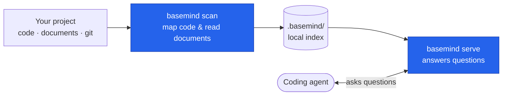
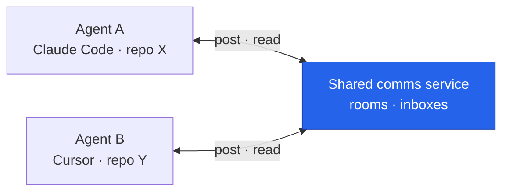

<!-- markdownlint-disable MD033 MD041 -->
<div align="center">

# basemind

**The context and communication layer for coding agents.**

basemind turns any repo into an always-current map of its code, documents, history, and memory —
so agents answer from **structure and search** instead of burning their context window on `grep` and
file reads — and gives a team of agents a **shared channel to coordinate** while they work. One
server does both.

Code map across **300+ languages** · documents in **90+ formats** · semantic + full-text search ·
git history & blame · shared memory · web crawl · agent-to-agent comms

[](https://crates.io/crates/basemind)
[](https://www.npmjs.com/package/basemind)
[](https://pypi.org/project/basemind/)
[](https://github.com/Goldziher/basemind/actions/workflows/ci.yaml)
[](LICENSE)

[Install](#installation) · [Features](#what-you-get) · [How it works](#how-it-works) · [Performance](#performance) · [CLI](#cli-reference)

</div>

---

<!-- markdownlint-disable MD013 -->
<p align="center"></p>
<p align="center"><em>An agent reasoning from structure — <code>outline</code> + <code>find_references</code> in a live session, statusline tracking tokens saved.</em></p>
<!-- markdownlint-enable MD013 -->

<div align="center"><sub><a href="#demos">More demos ↓</a></sub></div>

---

## What you get

basemind answers with **file paths, line numbers, and signatures — not whole files** — so a question
about your code costs a small fraction of the tokens it takes to read the source.

<!-- markdownlint-disable MD013 -->

| Capability | What it does | Key tools |
|---|---|---|
| **Code intelligence** | Find where things are defined, what calls what, who implements what, and how calls chain — across [300+ languages](#how-it-works). | `outline` · `search_symbols` · `find_references` · `find_callers` · `call_graph` · `find_implementations` · `workspace_grep` |
| **Git intelligence** | Ask what changed recently, who last touched a function, where the churn is, and how a file's structure differs across commits. | `blame_symbol` · `symbol_history` · `recent_changes` · `hot_files` · `diff_outline` · `commits_touching` |
| **Document search** | Search PDFs, Office files, HTML, email, and images by meaning — with built-in text extraction and OCR, no extra setup. | `search_documents` |
| **Shared memory** | A per-repo memory agents can write to and search; clones of the same repo share it, unrelated repos stay separate. | `memory_put` · `memory_search` · `memory_audit` |
| **Suggestions** | Spots files that change together and suggests notes worth saving — you approve before anything is kept. | `proposals_mine` · `proposal_accept` |
| **Web crawl** | Fetch a page or follow links from a starting URL; results join the document search above. | `web_scrape` · `web_crawl` · `web_map` |
| **Agent comms** | A shared chat for agents working the same code: rooms they auto-join and a personal inbox. | `room_post` · `room_history` · `inbox_read` · `message_get` |
| **Agent shells** | Let agents open, type into, and watch terminal sessions in the background (opt-in). | `shell_spawn` · `shell_send` · `shell_capture` · `shell_list` |
| **Token saving** | Hand an agent a file's outline instead of its full text, then pull back only the one function it needs. | `compress` · `expand` |
| **Admin** | Refresh the index, see what's been queried, and check or clean up the on-disk cache. | `rescan` · `telemetry_summary` · `cache_stats` |

<!-- markdownlint-enable MD013 -->

---

## Installation

Three ways to run basemind, easiest first. All three share the same local index and are safe to run
side by side.

> **The plugin downloads the basemind program for you** on first use. The MCP-server and CLI paths
> need it installed yourself — see [Install the program](#install-the-program).

### 1. As a plugin (recommended)

The plugin sets up everything for you — the server, the helper skills, the agent-comms features, and
the slash commands. Pick your coding tool.

<details>
<summary><strong>Claude Code</strong></summary>

In the session (not your shell), run in order:

```text
/plugin marketplace add Goldziher/basemind
/plugin install basemind@basemind
```

Restart, then run `/bm-statusline` once to turn on the live statusline (a one-time step — see
[Statusline](#install-the-program)).

</details>

<details>
<summary><strong>Codex</strong></summary>

```bash
codex plugin marketplace add Goldziher/basemind
codex plugin add basemind@basemind
```

In the app: open the **Plugins** sidebar and add basemind. The CLI and IDE share one config file.

</details>

<details>
<summary><strong>Cursor</strong></summary>

In Agent chat: `/add-plugin basemind` (once listed), or go to **Dashboard → Settings → Plugins →
Team Marketplaces → Import from Repo** and point it at `https://github.com/Goldziher/basemind`.

</details>

<details>
<summary><strong>Gemini CLI</strong></summary>

```bash
gemini extensions install https://github.com/Goldziher/basemind
```

Update later with `gemini extensions update basemind`.

</details>

<details>
<summary><strong>Factory Droid</strong></summary>

```bash
droid plugin marketplace add https://github.com/Goldziher/basemind
droid plugin install basemind@basemind
```

</details>

<details>
<summary><strong>GitHub Copilot CLI</strong></summary>

```bash
copilot plugin marketplace add Goldziher/basemind
copilot plugin install basemind@basemind
```

</details>

<details>
<summary><strong>OpenCode</strong></summary>

Add to `opencode.json` (project) or `~/.config/opencode/opencode.json` (global):

```json
{ "plugin": ["basemind-opencode@latest"] }
```

</details>

<details>
<summary><strong>Kimi Code</strong></summary>

```text
/plugins install https://github.com/Goldziher/basemind
```

Kimi doesn't support the comms auto-notifications, but the chat tools still work.

</details>

<details>
<summary><strong>Antigravity &amp; pi</strong></summary>

**Antigravity** uses a shared MCP config — [install the program](#install-the-program), then add the
[generic MCP block](#2-as-an-mcp-server). If you already use the Gemini extension,
`agy plugin import gemini` brings it across.

**pi**: `pi install git:github.com/Goldziher/basemind`. pi has no MCP support, so basemind runs
through its [CLI](#3-as-a-cli) here.

</details>

### 2. As an MCP server

If your tool speaks MCP but you're not using the plugin, [install the program](#install-the-program),
then register it:

```json
{
  "mcpServers": {
    "basemind": { "command": "basemind", "args": ["serve"] }
  }
}
```

Each tool says whether it only reads or can change things, so your client can auto-approve the safe
ones and ask before the rest. If `basemind` isn't found, use the full path from `which basemind`.

<details>
<summary><strong>Per-tool specifics</strong> (Claude Code · Cursor · Windsurf · Codex · Gemini · Copilot · Droid · Cline · Continue · OpenCode)</summary>

- **Claude Code** — `claude mcp add basemind -- basemind serve` (add `--scope user` for all
  projects; the `--` is required). Or commit a `.mcp.json` at the repo root with the block above.
- **Cursor** — put the block above in `.cursor/mcp.json` (project) or `~/.cursor/mcp.json` (global).
- **Windsurf** — `~/.codeium/windsurf/mcp_config.json` (or Cascade → MCP servers → manage), then
  **Refresh**.
- **Codex** — `codex mcp add basemind -- basemind serve`, shared by the CLI and IDE.
- **Gemini CLI** — `gemini mcp add basemind basemind serve`, or the block above in
  `~/.gemini/settings.json`.
- **GitHub Copilot CLI** — `/mcp add` in-session, or `~/.copilot/mcp-config.json` with
  `"type": "local"` and `"tools": ["*"]`.
- **Factory Droid** — `droid mcp add basemind "basemind serve"`, or `~/.factory/mcp.json`.
- **Cline** — MCP Servers icon → Configure → add the block above.
- **Continue** — `.continue/mcpServers/basemind.yaml` with `command: basemind`, `args: [serve]`.
- **OpenCode (without the plugin)** — `opencode.json` under key `mcp`, with `command` as an array
  `["basemind", "serve"]`.
- **Any other tool** — point it at the command `basemind` with the argument `serve`.

</details>

### 3. As a CLI

The standalone program, for scripts, headless runs, and CI. [Install it](#install-the-program), then:

```bash
basemind scan                          # index the project once
basemind query symbol "parseQuery"     # find a symbol by name
basemind query references "processFile" # find everywhere it's called
basemind git blame-file src/main.rs    # who last changed each line
basemind watch                         # keep the index fresh as files change
```

Full command list in the [CLI reference](#cli-reference).

### Install the program

The MCP and CLI paths need `basemind` available on your system. (The plugin does this for you.)

<!-- markdownlint-disable MD013 -->

| Channel | Command | Includes |
|---|---|---|
| Homebrew | `brew install Goldziher/tap/basemind` | everything |
| npm | `npm install -g basemind` | everything |
| pip | `pip install basemind` | everything |
| cargo | `cargo install basemind --locked` | code + git only |
| cargo (full) | `cargo install basemind --features full --locked` | everything |
| GitHub releases | [Download a binary](https://github.com/Goldziher/basemind/releases) | everything |

<!-- markdownlint-enable MD013 -->

The Homebrew / npm / pip / GitHub downloads include the full feature set — documents, OCR, search,
web crawl, and shared memory — so the first run downloads the models it needs. The plain
`cargo install` builds the code-map and git tools only.

<details>
<summary><strong>Statusline</strong> (Claude Code)</summary>

Run `/bm-statusline` once. This is a one-time step because Claude Code doesn't let plugins set the
main statusline themselves — so basemind asks the assistant to make the one-line settings change on
your behalf, and it sticks from then on.

It shows two lines:

```text
Opus · basemind · ⎇ main · 12% ctx
◆ basemind  ●  1,247 files · 23m ago  │  312 calls · 180 srch · 44 git · 12 docs  │  1.4M saved  │  ✉ 3 @reviewer
```

The dot is green when basemind is live and fresh, amber when idle, red when stale. The middle shows
activity by type, then tokens saved, then unread messages. Adjust with
`BASEMIND_STATUSLINE=full|compact|minimal`, or hide the top line with `BASEMIND_STATUSLINE_CONTEXT=0`.

</details>

---

## Demos

<!-- markdownlint-disable MD013 -->

<p align="center"></p>
<p align="center"><em>The same engine from the CLI — <code>scan</code>, then symbol / reference / call-graph / blame queries.</em></p>

<p align="center"></p>
<p align="center"><em>Searching documents by meaning, not keywords, across 90+ formats.</em></p>

<!-- markdownlint-enable MD013 -->

---

## How it works

<details>
<summary><strong>From one scan to instant answers</strong></summary>

`basemind scan` reads your project once, in parallel. It maps your code with
[tree-sitter] (across [300+ languages][tslp]) and pulls text out of your documents with
[kreuzberg], then saves the result to a local cache in `.basemind/`. After that, `basemind serve`
keeps the map in memory and answers questions instantly — no re-reading the project for each one.
When files change, it updates only what changed.



Search and memory are powered by a vector store ([LanceDB]).

</details>

<details>
<summary><strong>How agents coordinate</strong></summary>

A single shared service in the background lets agents talk to each other — even across different
tools and different repos on the same machine. Agents join **rooms** automatically based on what
they're working on, and each has a personal **inbox**. Messages come in two parts: a short headline
(subject and sender) that's cheap to skim, and the full body, fetched only when an agent wants to
read it. An agent never sees its own posts in its inbox.

The plugin makes sure agents notice messages without being asked — through the built-in instructions,
a notice at session start and each turn, and a quiet background check every few seconds.



</details>

<details>
<summary><strong>Agent shells</strong> (opt-in)</summary>

With the `shells` feature turned on, agents can open terminal sessions in the background, type into
them, and read what's on screen — no extra tools to install. Sessions can be fully headless, or
(on macOS and Linux) opened in a real terminal tab or window so you can watch along. When comms is
also on, a spawned session and the agent that started it can message each other.

</details>

---

## Token saving

<details>
<summary><strong>Good habits the plugin sets up for you</strong></summary>

The plugin nudges agents toward the cheap path by default:

- Get a file's outline before opening it — then read only the part you need.
- Search for a definition instead of grepping for it.
- Look up who calls a function instead of grepping for call sites.
- Refresh the index after edits instead of restarting the server.
- Don't re-read a file basemind already mapped.

Optional guardrails enforce this at the moment a tool is used:

- **Guard** — gently redirects `grep`-style searches to the matching basemind tool. On by default;
  set `BASEMIND_GUARD=off` to disable, or `redirect` to block instead of nudge.
- **Output compressor** — `BASEMIND_COMPRESS_OUTPUT=1` shrinks long command output. It never touches
  anything that looks like a credential and leaves output alone if it can't help.
- **Re-read shortcut** — `BASEMIND_DELTA_READS=1` shows just what changed when an agent re-reads a
  file it already read this session.

</details>

<details>
<summary><strong>Compression that understands code</strong></summary>

basemind shrinks code by keeping the shape and dropping the bodies — function signatures and imports
stay, the implementations go — because a signature is useless without its shape. For prose it does a
light cleanup (extra whitespace, filler, repeated paragraphs). It reports honest before/after token
counts, and the code version is exact — nothing is lost, just set aside. `expand` brings any one
function's full body back when an agent actually needs it: compress to an outline, expand only what
you need.

</details>

---

## Performance

<details>
<summary><strong>Scan speed &amp; query latency</strong></summary>

Measured on Apple Silicon with the full feature set. The first scan of a cold project is slower;
these are warm, steady-state numbers.

| Project | Files | Languages | Scan time |
|---|---|---|---|
| tokio | 859 | Rust | 0.2 s |
| react | 7 061 | TS / JSX | 2.2 s |
| django | 7 061 | Python | 2.5 s |
| requests | 2 195 | Python | 0.7 s |
| gin | 1 217 | Go | 1.0 s |
| ripgrep | 12 851 | Rust | 4.0 s |
| TypeScript compiler | 81 324 | TS / JS / JSON | ~22 s |

The TypeScript compiler is the worst case — 81k files in about 22 seconds. Re-scans only look at
what changed, so keeping a project up to date is far faster than the first scan.

Once running, most code questions answer in **under a millisecond**, symbol and call-graph searches
in a few milliseconds, and document search in around 200 ms — because the map is held in memory
rather than read from disk each time.

</details>

---

## Configuration

<details>
<summary><strong>Config file &amp; overrides</strong></summary>

A minimal config — the full schema is at `schema/basemind-config-v1.schema.json`:

```toml
# .basemind/basemind.toml
file_watch_glob = "**/*.{rs,ts,tsx,py,go}"
eager_l2 = true

[documents]
enabled = true
```

Any tool call can override these settings for that one request, and settings map to environment
variables in the obvious way: `--llm-api-key` becomes `BASEMIND_LLM_API_KEY`.

</details>

---

## CLI reference

<details>
<summary><strong>Full command list</strong> — query · git · memory · suggestions · cache · web · comms</summary>

CLI commands mirror the MCP tools. Add `--json` for machine-readable output.

<!-- markdownlint-disable MD013 -->

**Query (`basemind query`)**

| Command | Purpose |
|---|---|
| `outline <path> [--l2]` | A file's structure: symbols, lines, signatures. `--l2` adds calls + docs. |
| `symbol <needle> [--kind]` | Find a symbol by name, optionally filtered by kind. |
| `search <needle>` | Text search across indexed files. |
| `references <name>` | Find everywhere a name is called. |
| `callers <path> <name> [--kind]` | Find callers of one specific definition. |
| `implementations <trait>` | Types that implement or inherit from a name. |
| `call-graph <name> [--direction --max-depth]` | Walk the call chain up or down. |
| `grep <pattern> [--language --path-contains]` | Pattern search with filters. |
| `list-files [--path-contains --language]` | List indexed files. |
| `status` / `repo-info` | Project overview / git info (branch, HEAD, origin). |
| `dependents <module>` | What imports a given module. |

**Git (`basemind git`)**

| Command | Purpose |
|---|---|
| `working-tree-status` | What's staged and unstaged right now. |
| `recent-changes [--limit]` | Recent commits with their files. |
| `commits-touching <path>` / `find-commits-by-path <pattern>` | Commits for a path or pattern. |
| `hot-files [--limit]` | The most frequently changed files. |
| `diff-file <path> <old> <new>` / `diff-outline <path> [--rev]` | File or structure diff across commits. |
| `blame-file <path>` / `blame-symbol <path> <name>` | Who last changed each line / a symbol. |
| `symbol-history <path> <name>` | When a symbol's body changed over time. |

**Memory (`basemind memory`)**

| Command | Purpose |
|---|---|
| `put <key> <value>` / `get <key>` / `delete <key>` | Store, retrieve, or remove a value. |
| `list [--prefix]` | List keys, optionally by prefix. |
| `search <query>` | Search stored values by meaning. |
| `search-documents <query>` | Search documents and memory together. |

**Suggestions (`basemind governance`)**

| Command | Purpose |
|---|---|
| `mine [--commits --min-count --min-confidence --max-files]` | Suggest notes from files that change together. |
| `proposals [--kind --limit]` | List pending suggestions. |
| `accept <id> [--key]` / `reject <id> [--reason]` | Keep a suggestion / dismiss it for good. |

**Cache (`basemind cache`)**

| Command | Purpose |
|---|---|
| `stats` | How much space the cache uses. |
| `gc` | Reclaim unused space (safe while the server runs). |
| `clear --component <comp>` | Clear part of the cache (`views`, `blobs`, `git-cache`, `all`, …). |

**Web (`basemind web`)**

| Command | Purpose |
|---|---|
| `scrape <url>` | Fetch and index a single page. |
| `crawl <seed-url>` | Follow links from a starting URL. |
| `map <url>` | Discover a site's pages without fetching bodies. |

**Comms (`basemind comms`)**

| Command | Purpose |
|---|---|
| `rooms` / `join <room>` / `leave <room>` / `room-create <room>` | List, join, leave, or create rooms. |
| `post <room> <subject> [--body --reply-to --tag]` | Post a message. |
| `history <room>` / `inbox [--mark-read]` | Recent messages in a room / your inbox. |
| `read <id>` | Read one message in full. |
| `register --name <handle>` / `agents` | Set your handle / list active agents. |
| `status` / `start` / `stop` | The shared service: check, start, or stop it. |

**Other commands (`scan`, `serve`, `watch`, …)**

| Command | Purpose |
|---|---|
| `scan` / `rescan <path>` | Full scan / update one path. |
| `watch` | Keep the index fresh as files change (no server). |
| `serve [--no-watch]` | Start the server (keeps the index fresh by default). |
| `init` | Create a `.basemind/` folder with a default config (optional). |
| `lang <list\|install\|clean>` | Manage downloaded language grammars. |
| `hook install` | Add a git pre-commit hook that runs a scan. |
| `compress-output` / `delta --old <path>` | Backends for the optional guardrails above. |
| `checkpoint` / `detect-waste` | Summarize a session / flag wasteful tool use. |
| `telemetry` | What's been queried and how many tokens were saved. |

<!-- markdownlint-enable MD013 -->

</details>

---

## License

MIT — see [LICENSE](LICENSE).

[tree-sitter]: https://tree-sitter.github.io/tree-sitter/
[tslp]: https://github.com/Goldziher/tree-sitter-language-pack
[kreuzberg]: https://github.com/Goldziher/kreuzberg
[LanceDB]: https://github.com/lancedb/lancedb
