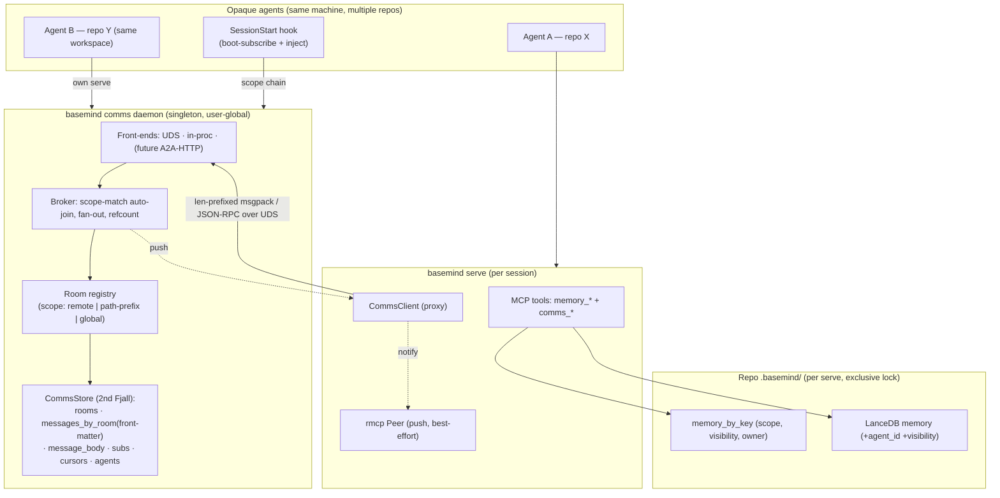

# Architecture

basemind is a single Rust crate that builds one binary (`basemind`) and exposes
its internals as a library. The binary is two roles in one: `basemind scan`
indexes a workspace into `.basemind/`; `basemind serve` runs the MCP stdio
server over the indexed data.

```text
                    ┌─────────────┐
                    │ basemind    │
                    │ scan        │
                    └─────┬───────┘
                          │
              ┌───────────┼───────────┐
              ▼           ▼           ▼
       Tree-sitter   Content-addr.  Fjall LSM
       parser pool   msgpack blobs  inverted idx
       (300+ langs)  (.basemind/    (.basemind/
                     blobs/)        views/<view>/
                                    index.fjall/)
              │           │           │
              └───────────┼───────────┘
                          ▼
                    ┌─────────────┐
                    │ basemind    │  ◀── MCP stdio (rmcp)
                    │ serve       │
                    └─────┬───────┘
                          ▼
                ┌─────────────────────┐
                │ AI coding agent     │
                │ (Claude Code,       │
                │  Cursor, Continue,  │
                │  …)                 │
                └─────────────────────┘
```

## Source layout

```text
src/
├── lib.rs                  — public re-exports
├── main.rs                 — CLI entry (scan, serve, watch, query, lang, …)
├── version.rs              — RELEASE_MINOR — single source of truth for schema versions
├── scanner.rs              — rayon-parallel file walker; per-file extraction
├── scanner_docs.rs         — document-tier scan (PDF/Office/HTML → LanceDB)
├── store.rs                — content-addressed msgpack blob store; holds IndexDb handle
├── index/
│   ├── mod.rs              — Fjall-backed secondary index; INDEX_SCHEMA_VER
│   ├── keys.rs             — length-prefixed composite key encodings
│   └── writer.rs           — atomic read-before-write upsert; per-file commit
├── extract/                — tree-sitter extraction tiers
│   ├── l1.rs               — outlines (symbols, signatures, imports, docs)
│   ├── l2.rs               — call sites (callee, byte offset, line/col)
│   ├── l3.rs               — structural hash of symbol bodies
│   └── doc.rs              — kreuzberg integration; FileMapDoc (+ keywords,
│                             entities, summary on the documents path)
├── config/                 — schema-driven config (TOML/CLI/MCP/env)
│   ├── v1.rs               — top-level ConfigV1, LlmConfig (schemars-derived)
│   ├── documents.rs        — DocumentsConfig + sub-configs, ApiKey, SecretString
│   ├── overrides.rs        — DocumentsCliOverrides — backs clap and MCP flatten
│   ├── layered.rs          — merge_layers (Mcp > Cli > Env > File > Default)
│   └── source.rs           — ConfigSource + ProvenanceMap ledger
├── mcp/                    — MCP server
│   ├── mod.rs              — server bootstrap
│   ├── tools.rs            — #[tool] methods (thin wrappers; 1000-line cap)
│   ├── tools_admin.rs,
│   │   tools_git.rs,
│   │   tools_memory.rs,
│   │   tools_web.rs        — area-sliced tool shims
│   ├── helpers.rs          — tool bodies; shared scan / decode helpers
│   ├── helpers_calls.rs,
│   │   helpers_documents.rs,
│   │   helpers_graph.rs,
│   │   helpers_grep.rs,
│   │   helpers_impls.rs,
│   │   helpers_web.rs      — area-sliced helper bodies
│   ├── memory.rs           — search_documents + memory_* (LanceDB-backed)
│   ├── types.rs,
│   │   types_documents.rs,
│   │   types_graph.rs,
│   │   types_impls.rs      — JsonSchema-derived request / response structs
│   ├── cursor.rs           — cursor encoding for paginated tools
│   ├── savings.rs          — token-savings heuristics for telemetry
│   └── telemetry.rs        — per-call telemetry.jsonl writer
├── query.rs                — read-side helpers shared by MCP tools + CLI
├── git.rs + git_cache.rs   — gix-backed history, blame, churn
├── path.rs                 — RelPath: byte-precise repo-relative paths
├── lang.rs                 — LangId = &'static str (TSLP pack name), parser pool,
│                             query cache, override-then-TSLP-fallback try_get_query
├── queries/<pack-name>.scm — hand-written extraction queries (override TSLP tags.scm)
├── render.rs, hashing.rs, watcher.rs                   — supporting modules
```

## Scan pipeline

```text
Walker (gitignore-aware)
  → filter by user glob + size cap
  → rayon par_iter
    → process_file(rel, contents):
        lang::detect()                — TSLP extension → LangId (or skip)
        L1 outline   (always)         — extract::l1
        L2 calls     (eager if cfg)   — extract::l2
        Store::write_l1               — content-addressed msgpack blob
        Store::write_l2 (if eager)
        IndexWriter::upsert_file(...) — Fjall secondary index
        per-file commit               — atomic batch
  → collect FileResult { rel, l1_hash, l2_hash?, … }
  → apply_outcomes:
        write Index meta
        prune deleted files via IndexWriter::remove_file
```

Key invariants:

- **Per-file commit** — every `process_file` commits its Fjall batch before
  returning. Fjall handles cross-thread locking; the scanner does not.
- **Atomic upsert** — `IndexWriter::upsert_file` is read-before-write: read
  existing primary entries first to derive secondary-index keys for deletion,
  then stage all deletes + inserts in one batch. No torn state on re-scan.
- **Eager L2 cost** — scanning TypeScript at ~81 k files takes ~22 s with
  eager L2 on (the default). The `scan.eager_l2 = false` escape hatch trades
  reference search for fastest scan.
- **`scan_paths` removal mirror** — when a file disappears between scans,
  `scan_paths` calls `IndexWriter::remove_file` so secondary indexes don't leak
  stale entries.

## Inverted index

A Fjall LSM keyspace at `.basemind/views/<view>/index.fjall/`. Source:
`src/index/{mod,keys,writer}.rs`.

| Keyspace | Purpose |
|---|---|
| `meta` | Constants (e.g. `schema_ver`). |
| `symbols_by_path` | Per-file outline lookups. |
| `symbols_by_name` | `name`-prefix range scans for symbol search. |
| `calls_by_path` | Per-file call lookups. |
| `calls_by_callee` | `callee`-prefix range scans — drives `find_references`. |
| `imports_by_module` | `module`-prefix range scans — drives `dependents`. |
| `imports_by_path` | Per-file import lookups. |
| `implementations_by_trait` | `trait`-prefix range scans — drives `find_implementations`. |
| `implementations_by_path` | Per-file implementation lookups. |
| `embeddings` | Reserved for in-Fjall vector index; LanceDB owns the live vectors. |
| `memory_by_key` | Agent memory (`memory_put` / `memory_get`); LanceDB owns the embeddings. |

Key shapes (length-prefixed, see `src/index/keys.rs`):

```text
symbols_by_path     u16:len(rel) ‖ rel ‖ start_byte:u32_be
symbols_by_name     u16:len(name) ‖ name ‖ kind:u8 ‖ u16:len(rel) ‖ rel ‖ start_byte:u32_be
calls_by_path       u16:len(rel) ‖ rel ‖ start_byte:u32_be
calls_by_callee     u16:len(callee) ‖ callee ‖ u16:len(rel) ‖ rel ‖ start_byte:u32_be
imports_by_module   u16:len(module) ‖ module ‖ u16:len(rel) ‖ rel ‖ start_byte:u32_be
```

Length-prefixed components guarantee prefix-scan isolation: a `Foo` prefix never
spills into `Foobar`. Schema version is stamped in the `meta` keyspace; mismatch
on open drops the whole `index.fjall/` directory and the next scan rebuilds it.

## Schema versioning

Two on-disk schemas, both tracking `RELEASE_MINOR` from `src/version.rs`:

- `INDEX_SCHEMA_VER` in `src/index/mod.rs` — Fjall partition / key encoding
- `SCHEMA_VER` in `src/extract/mod.rs` — msgpack blob format

Bump cadence:

- Minor release (`0.1.x` → `0.2.0`) bumps `RELEASE_MINOR` → both caches wipe
  on next scan.
- Patch release (`0.1.0` → `0.1.1`) MUST be cache-compatible — never bump from
  a patch commit.

Wipe-on-mismatch is the migration story; the next `basemind scan` rebuilds from
source.

## MCP surface

`basemind serve` exposes a stdio MCP server (`rmcp`). The live contract is
`tests/mcp_smoke.rs`.

Conventions:

- All paths are `RelPath` (byte-precise, repo-relative). No arbitrary `String`
  paths.
- Responses are `JsonSchema`-derived and stable; new fields are additive with
  `#[serde(default)]`.
- Lists are capped (`limit`, default 100, max 1000). Index scans use
  `scan_cap = limit * 8` to bound work on common names.
- Tool descriptions are the routing surface for agents; semantics (substring vs
  prefix, scope-aware vs name-only) are stated honestly.
- Tool bodies live in `src/mcp/helpers*.rs` (area-sliced: `helpers_documents.rs`,
  `helpers_calls.rs`, `helpers_graph.rs`, `helpers_grep.rs`, `helpers_impls.rs`,
  `helpers_web.rs`); `tools.rs` and the `tools_<area>.rs` siblings contain
  `#[tool]` shims only.

## Git layer

`gix`-backed log, blame, diff, and status. The git cache at `.basemind/git-cache/`
has two tiers:

- An in-process LRU (1024 entries per category by default; tune via
  `basemind serve --git-cache-mem`).
- A sha-keyed disk store: `commit_files/<sha>.msgpack`,
  `log/<head_sha>__<scope>.msgpack`, `blame/<sha>__<path_hash>.msgpack`.

Commits are immutable, so once a sha-keyed entry is on disk it's valid forever.
HEAD-keyed entries (`log`) roll off naturally when HEAD moves.

Drop the disk cache with `basemind cache clear`. Disable per-run with
`basemind serve --no-git-cache-disk`.

## Hardening

`tests/harden.rs` is the real-OSS canary harness. `#[ignore]`-gated; run with:

```bash
cargo test --release --test harden -- --ignored --nocapture
```

It clones 8 upstream repos under `/tmp/basemind-harden/` (`ripgrep`, `tokio`,
`typescript`, `react`, `django`, `requests`, `gin`, plus a shallow `ripgrep`
variant), runs `basemind scan` on each, then sweeps every MCP code-map tool plus
a representative subset of git tools. Canary assertions catch regressions:

- **tokio**: `find_references("spawn")` returns ≥ 200 hits
- **django**: `find_references("get")` returns ≥ 200 hits
- **react**: `search_symbols("useState")` returns ≥ 20 hits
- **ripgrep-shallow**: `any_truncated == true` (shallow-clone signal surfaces)

Per-repo metrics land at `/tmp/basemind-harden-*.log`.

## Agent comms & split memory



### Why a separate daemon

Each `basemind serve` takes an exclusive flock on the repo's `.basemind/` store, so
the comms substrate cannot live there. It lives in a separate, user-global,
daemon-owned second Fjall store (path via the `directories` crate;
`BASEMIND_COMMS_DIR` overrides). The daemon is a singleton enforced by
socket-bind-as-lock (a Unix domain socket whose successful bind IS the lock);
stale sockets are reclaimed probe-before-unlink. It auto-starts on first need,
goes idle with no subscribers (socket stays bound as a split-brain guard), and
stops on explicit `comms stop`.

### Chat-server room model

Rooms are registered in a central registry owned by the daemon. Each room has a
scope: a git remote, a path prefix, or global (`RoomScope = Remote | PathPrefix
| Global`). At boot an agent computes its scope chain (repo remote + cwd +
ancestor dirs up to a workspace/`$HOME` boundary) and auto-joins every
registered room whose scope covers it — so per-repo rooms, workspace rooms
spanning sibling repos (horizontal monorepo), and nested repos all work via
ancestor/prefix matching. Agents can also explicitly create/list/join rooms
across repos.

### Condensed two-tier messages

A message is a front-matter envelope (`id, room, from, ts_micros, subject, tags,
reply_to, body_len, body_sha`) stored in `messages_by_room`, plus a
separately-stored body in `message_body` keyed by message id. `room_history` and
`inbox_read` scan front-matter ONLY — never the body — to stay token-frugal; the
body is fetched on demand by `message_get {message_id}`. Poster supplies a
required short `subject` plus an optional long body.

### Split memory

Repo memory is namespaced by `(scope, visibility, owner)`: the `memory_by_key`
Fjall key is `(scope, vis_byte, owner, key)` and the LanceDB memory table gained
`agent_id` + `visibility` columns. Group memory (`visibility=group`, default,
`owner=""`) is shared across agents in a repo; individual memory
(`visibility=individual`, `owner=agent_id`) is private to one agent. Default is
`group` for back-compat. Schema is guarded by `MEMORY_SCHEMA_VER` (derives from
`RELEASE_MINOR`); a mismatch wipes and rebuilds.

### Identity & delivery

Agent identity resolves as `BASEMIND_AGENT_ID` env → `config.comms.agent_id` →
a persisted per-repo `.basemind/agent-id` (`session-<pid>-<nanos>`) → `anon`.
Notification delivery is hook-driven: the SessionStart hook boot-subscribes and
injects the comms levers + condensed recent history; a `UserPromptSubmit` hook
(`inbox-notify`) injects messages newer than a per-session high-water mark each
turn. MCP push via the rmcp `Peer` is best-effort/secondary (Claude Code only
surfaces `list_changed`).

### A2A

Message and agent-card shapes are schema-aligned with the A2A (Agent2Agent)
protocol so a future A2A-HTTP front-end can be added behind the same
`CommsFrontend` trait; the HTTP/SSE server and cross-machine rooms are
deferred.
