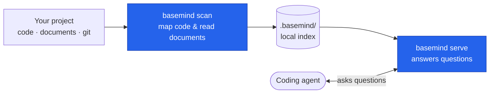

basemind turns your project into an always-current map through two simple steps: a one-time
parallel scan that reads everything, then an in-memory server that answers questions instantly.
When files change, it updates only what's touched — no re-read of the whole codebase.

## The scan

`basemind scan` reads your project once, in parallel. It maps your code with
[tree-sitter](https://tree-sitter.github.io/tree-sitter/) across
[300+ languages](https://github.com/Goldziher/tree-sitter-language-pack) and extracts text from
your documents using [xberg](https://github.com/xberg-io/xberg), then saves the results to a local
`.basemind/` cache.

This happens once at setup, then incrementally as you work: when you open a file editor, basemind
detects the change and re-indexes only that file.

### Structure extraction

The scan builds a structural index: for each file, it extracts the symbols (functions, classes,
types), their signatures, their line/column positions, and what they call — all without running
the code. This is tree-sitter's job: it parses source code into an abstract syntax tree (AST),
and basemind runs hand-tuned queries over that tree to find the pieces you care about.

### Document extraction

If you have PDFs, Office documents, HTML, email, or images, basemind extracts their text (with
OCR for images) and indexes their content for semantic search.

## The server

`basemind serve` loads the index into memory and exposes it as an MCP server. From here, code
questions answer in milliseconds: "Where is `parseQuery` defined?", "What calls `processFile`?",
"Show me the outline of this file." — all instant, because the map is already in RAM.

Each tool call resolves to a lookup in the in-memory index, not a re-read of the project.

## Re-scans

When you edit code, basemind detects the change and re-scans the affected file. Other files stay
unchanged. This means keeping the index fresh as you work costs far less than the initial scan.

## Index lifecycle and freshness

`basemind serve` answers the MCP handshake immediately and warms the code map into memory in the
background, so a client never blocks waiting for a large repo to load. The `status` tool reports
`warming` (still loading) and, once done, `warm_ms`; a first-time index build similarly reports
`indexing` / `index_build_ms`.

While the server isn't fully ready, `status` and every code-map read tool may carry a `notice`
object — `{ state, message, retry }` — instead of (or alongside) their normal result:

| `state` | Meaning | `retry` |
|---|---|---|
| `warming_up` | Loading an existing index into memory. | `true` |
| `building_index` | Indexing from scratch (no `.basemind/` yet). | `true` |
| `rescanning` | Incremental rescan after a file change; results are usable but may be stale. | `false` |

Treat an empty or partial result carrying a `notice` as "retry shortly," not "no matches" — poll
`status` (or just retry the call) until the notice clears.

## Markdown and Obsidian as first-class

Markdown and Obsidian vaults are indexed like code:

- **Headings** become navigable symbols — `outline` and `search_symbols` work over a notes vault.
- **Wikilinks** (`[[Note]]`), **embeds** (`![[Note.md]]`), and standard **links** (`[text](Note.md)`)
  all become references — so `find_references "Note"` returns that note's backlinks regardless of
  link style.
- **Tags** (`#project` inline or in YAML frontmatter) become references too — so
  `find_references "#project"` lists every note carrying that tag.

This means you can navigate your documentation and personal notes with the same tools you use for code.

## Vector search and memory

Search and memory (semantic search over documents and stored notes) are powered by
[LanceDB](https://github.com/lancedb/lancedb), an in-process vector database. When you call
`search_documents`, basemind compares your query against the embeddings of every document chunk
and returns the closest matches by meaning, not just by keywords.

The shared memory store works the same way: agents can write notes to `memory_put`, and other
agents search that memory with `memory_search` using semantic similarity.

